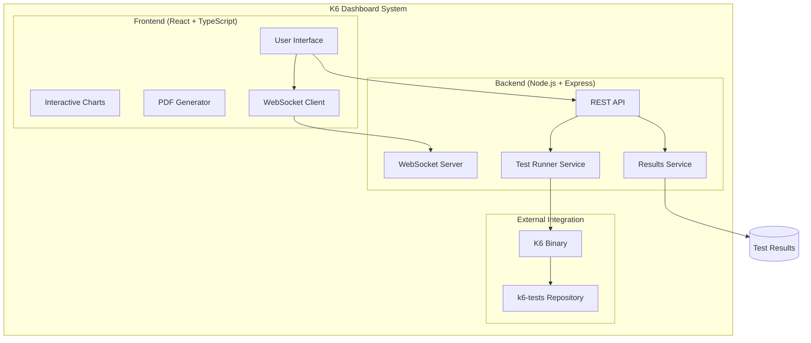

# K6 Performance Dashboard

<div align="center">


**Professional Performance Testing Dashboard for K6 Tests**

[Features](#-features) • [Architecture](#-architecture) • [Installation](#-installation) • [Usage](#-usage) • [Technology Stack](#-technology-stack)

</div>

---

## 📋 Table of Contents

- [Overview](#-overview)
- [Features](#-features)
- [Architecture](#-architecture)
- [Technology Stack](#-technology-stack)
- [Project Structure](#-project-structure)
- [Components Deep Dive](#-components-deep-dive)
- [Installation & Setup](#-installation--setup)
- [Configuration](#-configuration)
- [Usage Guide](#-usage-guide)
- [API Documentation](#-api-documentation)
- [Development](#-development)
- [Deployment](#-deployment)

## 🎯 Overview

K6 Performance Dashboard is a comprehensive, enterprise-grade web application designed to visualize, manage, and analyze K6 performance test results. The dashboard seamlessly integrates with the [k6-tests repository](https://github.com/dar-kow/k6-tests) to provide real-time test execution, advanced analytics, and professional PDF reporting capabilities.

### Why This Solution?

Traditional performance testing often lacks proper visualization and real-time monitoring capabilities. This dashboard bridges that gap by providing:

- **Real-time test execution monitoring** with live terminal output
- **Advanced data visualization** with interactive charts and graphs
- **Professional PDF reports** for stakeholder communication
- **Multi-environment support** with custom token management
- **Historical data analysis** for performance trend tracking

## 🚀 Features

### 📊 Advanced Dashboard Analytics
- **Real-time performance metrics** visualization
- **Interactive charts** using Recharts library
- **Multi-dimensional data analysis** (response times, throughput, error rates)
- **Comparative analysis** between test runs
- **Performance trend tracking** over time

### 🏃 Test Runner with Live Terminal
- **Real-time test execution** with WebSocket streaming
- **Environment selection** (PROD/DEV) with visual indicators
- **Custom token management** for authenticated endpoints
- **Load profile selection** (LIGHT/MEDIUM/HEAVY)
- **Individual or sequential test execution**
- **Live progress tracking** with K6 progress bars
- **Test interruption capability** with graceful shutdown

### 📑 Professional PDF Reports
- **Clean, professional design** using @react-pdf/renderer
- **Executive summary** with key metrics
- **Detailed performance analysis** with charts
- **Multi-page reports** with comprehensive insights
- **Automatic report generation** for each test run
- **Export capabilities** for individual tests or complete suites

### 🔍 Test Results Browser
- **Hierarchical test organization** by date and type
- **Individual test analysis** with detailed metrics
- **Sequential run analysis** for multi-test suites
- **Virtual directory support** for single test files
- **Tabbed interface** for easy navigation
- **Export functionality** for data and reports

## 🏗 Architecture

### System Design



### Data Flow

1. **Test Execution Flow**
   - User selects test configuration in UI
   - Request sent to backend API
   - Backend spawns K6 process with selected parameters
   - K6 executes tests from k6-tests repository
   - Real-time output streamed via WebSocket
   - Results saved to filesystem

2. **Results Analysis Flow**
   - Backend scans results directory
   - Frontend requests available test runs
   - User selects specific run for analysis
   - Backend loads and parses JSON results
   - Frontend renders interactive visualizations
   - PDF reports generated on demand

## 💻 Technology Stack

### Frontend Technologies

| Technology | Purpose | Version |
|------------|---------|---------|
| **React** | UI Framework | 18.x |
| **TypeScript** | Type Safety | 5.x |
| **Tailwind CSS** | Styling Framework | 3.x |
| **Recharts** | Data Visualization | 2.x |
| **@react-pdf/renderer** | PDF Generation | 4.x |
| **Socket.io-client** | Real-time Communication | 4.x |
| **React Router** | Navigation | 6.x |
| **Axios** | HTTP Client | 1.x |

### Backend Technologies

| Technology | Purpose | Version |
|------------|---------|---------|
| **Node.js** | Runtime Environment | 18.x |
| **Express** | Web Framework | 4.x |
| **TypeScript** | Type Safety | 5.x |
| **Socket.io** | WebSocket Server | 4.x |
| **K6** | Load Testing Tool | 0.43.x |

### Infrastructure & DevOps

| Technology | Purpose |
|------------|---------|
| **Docker** | Containerization |
| **Docker Compose** | Multi-container orchestration |
| **Nginx** | Reverse proxy (production) |
| **GitHub Actions** | CI/CD pipeline |

## 📁 Project Structure

```
k6-dashboard/
├── frontend/                     # React frontend application
│   ├── public/                   # Static assets
│   ├── src/
│   │   ├── api/                  # API client modules
│   │   │   └── results.ts        # Results API endpoints
│   │   ├── components/           # Reusable UI components
│   │   │   ├── charts/           # Chart components
│   │   │   │   ├── AreaChart.tsx
│   │   │   │   ├── BarChart.tsx
│   │   │   │   ├── LineChart.tsx
│   │   │   │   ├── MultiBarChart.tsx
│   │   │   │   ├── MultiLineChart.tsx
│   │   │   │   └── PieChart.tsx
│   │   │   ├── DirectorySelector.tsx
│   │   │   ├── Layout.tsx
│   │   │   ├── MetricCard.tsx
│   │   │   ├── StatusCard.tsx
│   │   │   ├── SummaryCard.tsx
│   │   │   ├── TerminalOutput.tsx
│   │   │   ├── TestResultDetail.tsx
│   │   │   ├── TestResultTabs.tsx
│   │   │   ├── TestRunComparison.tsx
│   │   │   ├── TestRunSelector.tsx
│   │   │   └── TestSelector.tsx
│   │   ├── context/              # React context providers
│   │   │   ├── ExportPDFButton.tsx
│   │   │   ├── PDFReportGenerator.tsx
│   │   │   ├── SingleTestPDFReport.tsx
│   │   │   └── TestResultContext.tsx
│   │   ├── pages/                # Page components
│   │   │   ├── Dashboard.tsx
│   │   │   ├── TestResults.tsx
│   │   │   └── TestRunner.tsx
│   │   ├── types/                # TypeScript type definitions
│   │   │   └── testResults.ts
│   │   ├── App.tsx               # Main application component
│   │   └── index.tsx             # Application entry point
│   ├── package.json
│   └── tsconfig.json
│
├── backend/                      # Node.js backend application
│   ├── src/
│   │   ├── routes/               # API route handlers
│   │   │   ├── results.ts
│   │   │   ├── runner.ts
│   │   │   └── tests.ts
│   │   ├── services/             # Business logic services
│   │   │   ├── resultsService.ts
│   │   │   ├── runnerService.ts
│   │   │   └── testsService.ts
│   │   ├── websocket/            # WebSocket configuration
│   │   │   └── socket.ts
│   │   └── index.ts              # Server entry point
│   ├── package.json
│   └── tsconfig.json
│
├── docker/                       # Docker configuration
│   ├── Dockerfile.frontend
│   ├── Dockerfile.backend
│   └── nginx.conf
│
├── k6-tests/                     # Cloned from github.com/dar-kow/k6-tests
│   ├── config/
│   ├── helpers/
│   ├── tests/
│   └── ...
│
├── results/                      # Test results storage
│   ├── sequential_*/             # Sequential test runs
│   ├── parallel_*/               # Parallel test runs
│   └── *.json                    # Individual test results
│
├── docker-compose.yml            # Docker orchestration
└── README.md                     # This file
```

## 🔧 Components Deep Dive

### Frontend Components

#### Dashboard Page
The main dashboard provides an executive overview of test performance:
- **Health Status Indicators**: Visual representation of system health
- **Key Metrics Summary**: Total requests, average response time, error rates
- **Interactive Charts**: Response time comparison, request volume analysis
- **Performance Trends**: Historical data visualization
- **Quick Actions**: Direct links to test runner and detailed results

#### Test Runner
Advanced test execution interface with:
- **Environment Toggle**: Switch between PROD/DEV environments
- **Token Management Modal**: Secure token input and storage
- **Profile Selection**: Choose from predefined load profiles
- **Real-time Terminal**: Live output with ANSI color support
- **Progress Tracking**: Visual K6 progress bars
- **Stop Functionality**: Graceful test interruption

#### Test Results Browser
Comprehensive results analysis interface:
- **Directory Navigation**: Browse test runs by date and type
- **Tab-based Navigation**: Switch between multiple test results
- **Detailed Metrics Tables**: Response times, throughput, error rates
- **Performance Charts**: Visual representation of test data
- **Export Capabilities**: Generate PDF reports on demand

### Backend Services

#### Runner Service
Manages test execution lifecycle:
```typescript
// Spawns K6 process with configuration
runTest(test: string, profile: string, environment: string, token: string)

// Manages running processes
stopTest(testId: string)

// Streams output via WebSocket
processK6Output(data: string)
```

#### Results Service
Handles test result management:
```typescript
// Scans and returns available test directories
getResultDirectories(): TestDirectory[]

// Retrieves test files from directory
getResultFiles(directory: string): TestFile[]

// Loads and parses test results
getTestResult(directory: string, file: string): TestResult
```

### PDF Report Generation

The PDF generator creates professional reports with:
- **Executive Summary**: High-level performance overview
- **Detailed Metrics**: Comprehensive performance data
- **Visual Charts**: Rendered charts in PDF format
- **Multi-page Layout**: Organized sections for clarity
- **Branding Support**: Customizable headers and footers

## 🛠 Installation & Setup

### Prerequisites

- Docker and Docker Compose
- Node.js 18+ (for local development)
- Git

### Quick Start with Docker

```bash
# Clone the dashboard repository
git clone https://github.com/your-username/k6-dashboard.git
cd k6-dashboard

# Clone k6-tests repository
git clone https://github.com/dar-kow/k6-tests.git

# Start the application
docker-compose up -d

# Access the dashboard
open http://localhost
```

### Local Development Setup

```bash
# Backend setup
cd backend
npm install
npm run dev

# Frontend setup (new terminal)
cd frontend
npm install
npm start
```

## ⚙️ Configuration

### Environment Variables

#### Backend Configuration
```env
NODE_ENV=production
PORT=4000
FRONTEND_URL=http://localhost
```

#### Frontend Configuration
```env
REACT_APP_API_URL=http://localhost:4000/api
```

### K6 Test Configuration

The dashboard automatically integrates with the k6-tests repository structure:
- Test files are loaded from `k6-tests/tests/`
- Results are saved to `results/` directory
- Configuration is read from `k6-tests/config/env.js`

## 📖 Usage Guide

### Running Performance Tests

1. **Navigate to Test Runner**
   - Click "Test Runner" in the sidebar

2. **Configure Test Parameters**
   - Select environment (PROD/DEV)
   - Set custom token if required
   - Choose test to run
   - Select load profile

3. **Execute Tests**
   - Click "Run Selected Test" or "Run All Tests Sequentially"
   - Monitor real-time output in terminal
   - Stop tests if needed with the stop button

### Analyzing Results

1. **Access Test Results**
   - Click "Test Results" in the sidebar
   - Select test run from dropdown

2. **Review Performance Data**
   - Examine summary metrics
   - Analyze detailed charts
   - Review individual test tabs

3. **Generate Reports**
   - Click "Export Test PDF" for individual tests
   - Click "Export Detailed PDF Report" for comprehensive analysis

### Understanding Load Profiles

| Profile | Virtual Users | Duration | Use Case |
|---------|--------------|----------|----------|
| LIGHT | 10 | 60s | Quick validation |
| MEDIUM | 30 | 5m | Standard testing |
| HEAVY | 100 | 10m | Stress testing |

## 🔌 API Documentation

### REST Endpoints

#### Test Management
```http
GET /api/tests
Returns available test configurations

POST /api/run/test
Execute individual test
Body: { test, profile, environment, customToken, testId }

POST /api/run/all
Execute all tests sequentially
Body: { profile, environment, customToken, testId }

POST /api/run/stop
Stop running test
Body: { testId }
```

#### Results Management
```http
GET /api/results
Returns all test run directories

GET /api/results/:directory
Returns test files in directory

GET /api/results/:directory/:file
Returns specific test result data
```

### WebSocket Events

#### Client → Server
```javascript
'test_request': { test, profile, environment, customToken, testId }
'stop_test': { testId }
```

#### Server → Client
```javascript
'testOutput': { type: 'log'|'error'|'complete'|'stopped', data: string }
'resultsUpdated': { message, testName, resultFile, timestamp }
```

## 🔨 Development

### Code Style Guidelines

- **TypeScript**: Strict mode enabled
- **React**: Functional components with hooks
- **Styling**: Tailwind CSS utility classes
- **State Management**: React Context API
- **Testing**: Jest + React Testing Library

### Adding New Features

1. **New Chart Type**
   - Create component in `frontend/src/components/charts/`
   - Follow existing chart component patterns
   - Update dashboard to include new visualization

2. **New Test Integration**
   - Add test file to k6-tests repository
   - Update backend test discovery logic
   - Add UI support in test runner

### Building for Production

```bash
# Frontend build
cd frontend
npm run build

# Backend build
cd backend
npm run build

# Docker build
docker-compose build
```

## 🚀 Deployment

### Docker Deployment

```bash
# Production deployment
docker-compose -f docker-compose.prod.yml up -d
```

### Manual Deployment

1. **Backend Deployment**
   - Build TypeScript files
   - Set production environment variables
   - Use PM2 or similar process manager

2. **Frontend Deployment**
   - Build React application
   - Serve with Nginx or similar
   - Configure reverse proxy for API

### CI/CD Pipeline

Example GitHub Actions workflow:
```yaml
name: Deploy K6 Dashboard

on:
  push:
    branches: [main]

jobs:
  deploy:
    runs-on: ubuntu-latest
    steps:
      - uses: actions/checkout@v2
      - name: Deploy to VPS
        run: |
          ssh user@server 'cd /app && docker-compose pull && docker-compose up -d'
```

## 📊 Performance Considerations

- **Result Caching**: Implement Redis for frequently accessed results
- **File System Optimization**: Regular cleanup of old test results
- **WebSocket Scaling**: Consider Socket.io Redis adapter for multiple instances
- **PDF Generation**: Offload to background job queue for large reports

## 🔒 Security Best Practices

- **Token Management**: Tokens stored in browser localStorage with encryption
- **Input Validation**: All user inputs validated on backend
- **CORS Configuration**: Strict origin validation
- **File Access**: Restricted to designated directories only
- **Process Isolation**: K6 processes run with limited permissions

## 🤝 Contributing

1. Fork the repository
2. Create feature branch (`git checkout -b feature/amazing-feature`)
3. Commit changes (`git commit -m 'Add amazing feature'`)
4. Push to branch (`git push origin feature/amazing-feature`)
5. Open Pull Request

## 📝 License

This project is licensed under the MIT License - see the LICENSE file for details.

## 🙏 Acknowledgments

- [K6](https://k6.io/) for the excellent load testing tool
- [Grafana Labs](https://grafana.com/) for maintaining K6
- [React](https://reactjs.org/) community for the amazing ecosystem
- All contributors who help improve this dashboard

---

<div align="center">

**Built with ❤️ for the Performance Testing Community**

[Report Bug](https://github.com/your-username/k6-dashboard/issues) • [Request Feature](https://github.com/your-username/k6-dashboard/issues)

</div>