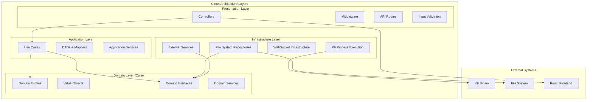
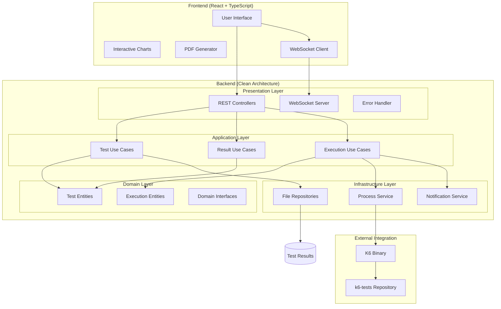
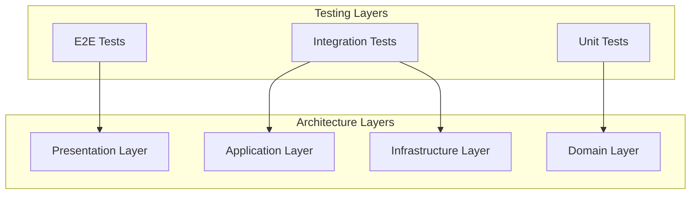

# K6 Performance Dashboard

<div align="center">


**Enterprise-Grade Performance Testing Dashboard with Clean Architecture**

[Features](#-features) • [Architecture](#-architecture) • [Installation](#-installation) • [Usage](#-usage) • [Technology Stack](#-technology-stack)

</div>

---

## 📋 Table of Contents

- [Overview](#-overview)
- [Features](#-features)
- [Architecture](#-architecture)
- [Technology Stack](#-technology-stack)
- [Project Structure](#-project-structure)
- [Backend Architecture Deep Dive](#-backend-architecture-deep-dive)
- [Installation & Setup](#-installation--setup)
- [Configuration](#-configuration)
- [Usage Guide](#-usage-guide)
- [API Documentation](#-api-documentation)
- [Development](#-development)
- [Deployment](#-deployment)

## 🎯 Overview

K6 Performance Dashboard is a comprehensive, enterprise-grade web application built with **Clean Architecture principles** for visualizing, managing, and analyzing K6 performance test results. The dashboard seamlessly integrates with the [k6-tests repository](https://github.com/dar-kow/k6-tests) to provide real-time test execution, advanced analytics, and professional PDF reporting capabilities.

### 🏗️ Architecture Highlights

- **Clean Architecture**: Complete separation of concerns with Domain → Application → Infrastructure → Presentation layers
- **SOLID Principles**: Dependency inversion, single responsibility, and interface segregation
- **Type Safety**: Full TypeScript implementation with strict mode
- **Dependency Injection**: Centralized IoC container for service management
- **Domain-Driven Design**: Rich domain entities with business logic
- **Error Handling**: Domain-specific errors with proper HTTP status codes

### Why This Solution?

Traditional performance testing often lacks proper visualization and architectural structure. This dashboard provides:

- **Enterprise-grade architecture** following Clean Architecture principles
- **Real-time test execution monitoring** with live terminal output
- **Advanced data visualization** with interactive charts and graphs
- **Professional PDF reports** for stakeholder communication
- **Multi-environment support** with custom token management
- **Historical data analysis** for performance trend tracking
- **Maintainable codebase** with proper separation of concerns

## 🚀 Features

### 📊 Advanced Dashboard Analytics
- **Real-time performance metrics** visualization
- **Interactive charts** using Recharts library
- **Multi-dimensional data analysis** (response times, throughput, error rates)
- **Comparative analysis** between test runs
- **Performance trend tracking** over time

### 🏃 Test Runner with Live Terminal
- **Real-time test execution** with WebSocket streaming
- **Environment selection** (PROD/DEV) with visual indicators
- **Custom token management** for authenticated endpoints
- **Load profile selection** (LIGHT/MEDIUM/HEAVY)
- **Individual or sequential test execution**
- **Live progress tracking** with K6 progress bars
- **Test interruption capability** with graceful shutdown

### 📑 Professional PDF Reports
- **Clean, professional design** using @react-pdf/renderer
- **Executive summary** with key metrics
- **Detailed performance analysis** with charts
- **Multi-page reports** with comprehensive insights
- **Automatic report generation** for each test run
- **Export capabilities** for individual tests or complete suites

### 🔍 Test Results Browser
- **Hierarchical test organization** by date and type
- **Individual test analysis** with detailed metrics
- **Sequential run analysis** for multi-test suites
- **Virtual directory support** for single test files
- **Tabbed interface** for easy navigation
- **Export functionality** for data and reports

## 🏗 Architecture

### Clean Architecture Overview



### System Architecture



### Data Flow with Clean Architecture

1. **Test Execution Flow**
   - User action → Controller → Use Case → Domain Service → Infrastructure Service
   - ExecuteTestUseCase validates business rules and delegates to TestExecutionService
   - K6TestExecutionService spawns process and streams output via NotificationService
   - Results persisted via Repository pattern

2. **Results Analysis Flow**
   - Controller → GetTestDirectoriesUseCase → TestResultRepository
   - Domain entities (TestDirectory, TestFile) encapsulate business logic
   - Mappers transform entities to DTOs for API responses
   - Clean separation between domain logic and presentation concerns

## 💻 Technology Stack

### Frontend Technologies

| Technology | Purpose | Version |
|------------|---------|---------|
| **React** | UI Framework | 18.x |
| **TypeScript** | Type Safety | 5.x |
| **Tailwind CSS** | Styling Framework | 3.x |
| **Recharts** | Data Visualization | 2.x |
| **@react-pdf/renderer** | PDF Generation | 4.x |
| **Socket.io-client** | Real-time Communication | 4.x |
| **React Router** | Navigation | 6.x |
| **Axios** | HTTP Client | 1.x |

### Backend Technologies (Clean Architecture)

| Technology | Purpose | Version |
|------------|---------|---------|
| **Node.js** | Runtime Environment | 18.x |
| **TypeScript** | Type Safety & Strict Mode | 5.x |
| **Express** | Web Framework | 4.x |
| **Socket.io** | WebSocket Server | 4.x |
| **dotenv** | Environment Configuration | 16.x |
| **Jest** | Testing Framework | 29.x |
| **ESLint + Prettier** | Code Quality & Formatting | Latest |
| **K6** | Load Testing Tool | 0.43.x |

### Architecture & Design Patterns

| Pattern/Principle | Implementation |
|------------------|----------------|
| **Clean Architecture** | Layered structure with dependency inversion |
| **SOLID Principles** | Dependency injection, interface segregation |
| **Repository Pattern** | Data access abstraction |
| **Use Case Pattern** | Business logic encapsulation |
| **Dependency Injection** | IoC container for service management |
| **Domain-Driven Design** | Rich domain entities with business logic |
| **Strategy Pattern** | Different test execution strategies |
| **Observer Pattern** | WebSocket notifications |

### Infrastructure & DevOps

| Technology | Purpose |
|------------|---------|
| **Docker** | Containerization |
| **Docker Compose** | Multi-container orchestration |
| **Nginx** | Reverse proxy (production) |
| **GitHub Actions** | CI/CD pipeline |

## 📁 Project Structure

```
k6-dashboard/
├── frontend/                     # React frontend application
│   ├── public/                   # Static assets
│   ├── src/
│   │   ├── api/                  # API client modules
│   │   ├── components/           # Reusable UI components
│   │   ├── context/              # React context providers
│   │   ├── pages/                # Page components
│   │   ├── types/                # TypeScript type definitions
│   │   ├── App.tsx               # Main application component
│   │   └── index.tsx             # Application entry point
│   ├── package.json
│   └── tsconfig.json
│
├── backend/                      # Clean Architecture Backend
│   ├── src/
│   │   ├── core/                 # 🏛️ DOMAIN LAYER (Core Business Logic)
│   │   │   ├── entities/         # Domain entities with business logic
│   │   │   │   ├── TestDirectory.ts
│   │   │   │   ├── TestFile.ts
│   │   │   │   ├── TestConfig.ts
│   │   │   │   ├── TestExecution.ts
│   │   │   │   ├── enums.ts      # Domain enums
│   │   │   │   └── index.ts
│   │   │   ├── value-objects/    # Value objects and commands
│   │   │   │   ├── Commands.ts   # Execute commands
│   │   │   │   ├── Events.ts     # Domain events
│   │   │   │   ├── TestOutput.ts # Test output value object
│   │   │   │   └── index.ts
│   │   │   ├── interfaces/       # Domain interfaces (contracts)
│   │   │   │   ├── common/       # Common interfaces
│   │   │   │   │   ├── IConfig.ts
│   │   │   │   │   └── ILogger.ts
│   │   │   │   ├── external/     # External service interfaces
│   │   │   │   │   ├── IFileSystem.ts
│   │   │   │   │   └── IProcessExecutor.ts
│   │   │   │   ├── repositories/ # Repository interfaces
│   │   │   │   │   ├── ITestRepository.ts
│   │   │   │   │   └── ITestResultRepository.ts
│   │   │   │   ├── services/     # Service interfaces
│   │   │   │   │   ├── ITestExecutionService.ts
│   │   │   │   │   └── INotificationService.ts
│   │   │   │   └── index.ts
│   │   │   ├── use-cases/        # Business use cases
│   │   │   │   ├── test-execution/
│   │   │   │   │   ├── ExecuteTestUseCase.ts
│   │   │   │   │   ├── ExecuteAllTestsUseCase.ts
│   │   │   │   │   ├── StopTestUseCase.ts
│   │   │   │   │   └── GetRunningTestsUseCase.ts
│   │   │   │   ├── test-results/
│   │   │   │   │   ├── GetTestDirectoriesUseCase.ts
│   │   │   │   │   ├── GetTestFilesUseCase.ts
│   │   │   │   │   └── GetTestResultUseCase.ts
│   │   │   │   ├── tests/
│   │   │   │   │   └── GetAvailableTestsUseCase.ts
│   │   │   │   └── index.ts
│   │   │   ├── errors/           # Domain-specific errors
│   │   │   │   ├── BaseError.ts
│   │   │   │   ├── DomainErrors.ts
│   │   │   │   └── index.ts
│   │   │   └── index.ts
│   │   │
│   │   ├── application/          # 🔧 APPLICATION LAYER (Use Cases & DTOs)
│   │   │   ├── dto/              # Data Transfer Objects
│   │   │   │   ├── TestExecutionDto.ts
│   │   │   │   ├── TestResultDto.ts
│   │   │   │   └── index.ts
│   │   │   ├── mappers/          # Entity ↔ DTO mappers
│   │   │   │   ├── TestExecutionMapper.ts
│   │   │   │   ├── TestResultMapper.ts
│   │   │   │   └── index.ts
│   │   │   ├── services/         # Application services
│   │   │   │   └── TestExecutionApplicationService.ts
│   │   │   └── index.ts
│   │   │
│   │   ├── infrastructure/       # 🏗️ INFRASTRUCTURE LAYER (External Concerns)
│   │   │   ├── external/         # External service implementations
│   │   │   │   ├── NodeFileSystem.ts
│   │   │   │   └── NodeProcessExecutor.ts
│   │   │   ├── repositories/     # Repository implementations
│   │   │   │   ├── FileSystemTestRepository.ts
│   │   │   │   └── FileSystemTestResultRepository.ts
│   │   │   ├── websocket/        # WebSocket infrastructure
│   │   │   │   ├── SocketIONotificationService.ts
│   │   │   │   └── WebSocketHandler.ts
│   │   │   └── index.ts
│   │   │
│   │   ├── presentation/         # 🌐 PRESENTATION LAYER (API & Web)
│   │   │   ├── controllers/      # HTTP controllers
│   │   │   │   ├── TestController.ts
│   │   │   │   ├── TestResultController.ts
│   │   │   │   ├── TestRunnerController.ts
│   │   │   │   └── HealthController.ts
│   │   │   ├── middleware/       # Express middleware
│   │   │   │   ├── ErrorHandler.ts
│   │   │   │   ├── RequestLogger.ts
│   │   │   │   ├── ValidationMiddleware.ts
│   │   │   │   └── SecurityMiddleware.ts
│   │   │   ├── routes/           # API routes
│   │   │   │   ├── TestRoutes.ts
│   │   │   │   ├── TestResultRoutes.ts
│   │   │   │   ├── TestRunnerRoutes.ts
│   │   │   │   └── HealthRoutes.ts
│   │   │   └── index.ts
│   │   │
│   │   ├── shared/               # 🔗 SHARED UTILITIES
│   │   │   ├── types/            # Shared type definitions
│   │   │   ├── utils/            # Utility functions
│   │   │   ├── constants/        # Application constants
│   │   │   └── index.ts
│   │   │
│   │   ├── config/               # ⚙️ CONFIGURATION
│   │   │   ├── Environment.ts    # Environment configuration
│   │   │   ├── Logger.ts         # Logging configuration
│   │   │   └── index.ts
│   │   │
│   │   ├── container.ts          # 📦 Dependency Injection Container
│   │   ├── app.ts                # 🚀 Application setup
│   │   └── server.ts             # 🎯 Entry point
│   │
│   ├── tests/                    # 🧪 Test suite
│   │   ├── unit/                 # Unit tests
│   │   ├── integration/          # Integration tests
│   │   ├── setup.ts              # Test setup
│   │   └── jest.setup.ts         # Jest configuration
│   │
│   ├── .env.example              # Environment variables template
│   ├── .eslintrc.js              # ESLint configuration
│   ├── jest.config.js            # Jest configuration
│   ├── nodemon.json              # Development server config
│   ├── package.json              # Dependencies and scripts
│   ├── start.sh                  # Startup script
│   └── tsconfig.json             # TypeScript configuration
│
├── docker/                       # Docker configuration
├── k6-tests/                     # Cloned from github.com/dar-kow/k6-tests
├── results/                      # Test results storage
├── docker-compose.yml            # Docker orchestration
└── README.md                     # This file
```

## 🏛️ Backend Architecture Deep Dive

### Clean Architecture Layers

#### 1. 🏛️ Domain Layer (Core)
The heart of the application containing business logic:

**Entities**: Rich domain objects with business behavior
```typescript
// TestDirectory.ts - Domain entity with business logic
export class TestDirectory {
  constructor(
    public readonly name: string,
    public readonly path: string,
    public readonly date: Date,
    public readonly type: "directory" | "virtual" = "directory"
  ) {}

  isVirtual(): boolean {
    return this.type === "virtual" || this.name.endsWith(".json");
  }

  getTestType(): string {
    if (this.isVirtual()) return "Individual Test";
    if (this.isSequential()) return "Sequential Run";
    return "Test Run";
  }
}
```

**Value Objects**: Immutable objects representing domain concepts
```typescript
// Commands.ts - Value objects for operations
export class ExecuteTestCommand {
  constructor(
    public readonly testName: string,
    public readonly profile: TestProfile,
    public readonly environment: Environment,
    public readonly customToken?: string
  ) {}

  getTestId(): string {
    return `${this.testName}-${Date.now()}`;
  }
}
```

**Use Cases**: Business operations and rules
```typescript
// ExecuteTestUseCase.ts - Business logic
export class ExecuteTestUseCase {
  constructor(
    private readonly testRepository: ITestRepository,
    private readonly testExecutionService: ITestExecutionService,
    private readonly logger: ILogger
  ) {}

  async execute(command: ExecuteTestCommand): Promise<TestExecution> {
    // Validate test exists
    const test = await this.testRepository.findByName(command.testName);
    if (!test) {
      throw new TestNotFoundError(command.testName);
    }

    // Execute business logic
    return await this.testExecutionService.executeTest(command);
  }
}
```

#### 2. 🔧 Application Layer
Orchestrates domain objects and external services:

**DTOs**: Data contracts for external communication
```typescript
export interface TestExecutionResponseDto {
  message: string;
  testId: string;
  config: {
    test?: string;
    profile: string;
    environment: string;
    hasCustomToken: boolean;
  };
}
```

**Mappers**: Transform between domain and external representations
```typescript
export class TestExecutionMapper {
  static toResponseDto(execution: TestExecution, message: string): TestExecutionResponseDto {
    return {
      message,
      testId: execution.testId,
      config: {
        test: execution.testName !== "all-tests" ? execution.testName : undefined,
        profile: execution.profile as string,
        environment: execution.environment as string,
        hasCustomToken: !!execution.customToken?.trim(),
      },
    };
  }
}
```

#### 3. 🏗️ Infrastructure Layer
Implements external concerns:

**Repository Implementations**: Data access
```typescript
export class FileSystemTestResultRepository implements ITestResultRepository {
  async findAll(): Promise<TestDirectory[]> {
    const resultsDir = await this.findResultsDirectory();
    const entries = await this.fileSystem.readDir(resultsDir);
    
    return entries
      .filter(entry => entry.isDirectory())
      .map(entry => new TestDirectory(entry.name, entry.path, this.extractDate(entry.name)));
  }
}
```

**External Service Adapters**: Process execution, file system
```typescript
export class NodeProcessExecutor implements IProcessExecutor {
  spawn(command: string, args: string[], options: ProcessOptions): IChildProcess {
    const child = spawn(command, args, {
      cwd: options.cwd,
      env: options.env,
      stdio: options.stdio || ['pipe', 'pipe', 'pipe'],
    });

    return {
      pid: child.pid || 0,
      stdout: child.stdout,
      stderr: child.stderr,
      // ... adapter methods
    };
  }
}
```

#### 4. 🌐 Presentation Layer
Handles HTTP concerns:

**Controllers**: HTTP request/response handling
```typescript
export class TestRunnerController {
  constructor(
    private readonly executeTestUseCase: ExecuteTestUseCase,
    private readonly logger: ILogger
  ) {}

  executeTest = async (req: Request, res: Response, next: NextFunction) => {
    try {
      const dto: TestExecutionRequestDto = req.body;
      const command = new ExecuteTestCommand(/* ... */);
      const execution = await this.executeTestUseCase.execute(command);
      const response = TestExecutionMapper.toResponseDto(execution, 'Test started successfully');
      res.json(response);
    } catch (error) {
      next(error);
    }
  };
}
```

### Dependency Injection Container

```typescript
export class DIContainer {
  private readonly services = new Map<string, any>();

  static getInstance(): DIContainer {
    if (!DIContainer.instance) {
      DIContainer.instance = new DIContainer();
    }
    return DIContainer.instance;
  }

  private registerServices(): void {
    // Configuration and Logger
    const config = new Environment();
    const logger = new ConsoleLogger(config.getLogLevel());
    
    // External services
    this.register<IFileSystem>('fileSystem', new NodeFileSystem());
    this.register<IProcessExecutor>('processExecutor', new NodeProcessExecutor());
    
    // Repositories
    this.register<ITestRepository>('testRepository', 
      new FileSystemTestRepository(
        this.get<IFileSystem>('fileSystem'),
        this.get<IConfig>('config'),
        this.get<ILogger>('logger')
      )
    );
    
    // Use cases
    this.register('executeTestUseCase',
      new ExecuteTestUseCase(
        this.get<ITestRepository>('testRepository'),
        this.get<ITestExecutionService>('testExecutionService'),
        this.get<ILogger>('logger')
      )
    );
  }
}
```

### Benefits of Clean Architecture Implementation

1. **Testability**: Easy unit testing with mocked dependencies
2. **Maintainability**: Changes isolated to specific layers
3. **Scalability**: Easy to add new features following established patterns
4. **Flexibility**: Can swap implementations (e.g., database instead of file system)
5. **Domain Focus**: Business logic separated from technical concerns

## 🛠 Installation & Setup

### Prerequisites

- Docker and Docker Compose
- Node.js 18+ (for local development)
- Git

### Quick Start with Docker

```bash
# Clone the dashboard repository
git clone https://github.com/your-username/k6-dashboard.git
cd k6-dashboard

# Clone k6-tests repository
git clone https://github.com/dar-kow/k6-tests.git

# Start the application
docker-compose up -d

# Access the dashboard
open http://localhost
```

### Local Development Setup

#### Backend Setup
```bash
cd backend

# Install dependencies
npm install

# Create environment configuration
cp .env.example .env

# Edit .env file with your paths:
# K6_TESTS_DIR=../k6-tests
# RESULTS_DIR=../k6-tests/results
# NODE_ENV=development
# LOG_LEVEL=debug

# Run in development mode
npm run dev
```

#### Frontend Setup
```bash
# In a new terminal
cd frontend
npm install
npm start
```

### Development Tools

#### Path debugging
```bash
# Run path debug script
cd backend
node debug-paths.js
```

#### Check configuration
```bash
# Visit debug endpoints
curl http://localhost:4000/debug/config
curl http://localhost:4000/debug/paths
curl http://localhost:4000/debug/dates
```

## ⚙️ Configuration

### Environment Variables

#### Backend Configuration (.env)
```env
# Server Configuration
NODE_ENV=development
PORT=4000
FRONTEND_URL=http://localhost:3000

# K6 Tests Configuration
# Path to k6-tests directory (relative to backend/ or absolute)
K6_TESTS_DIR=../k6-tests

# Results Configuration  
# Path to test results directory
RESULTS_DIR=../k6-tests/results

# Logging Level (debug, info, warn, error)
LOG_LEVEL=debug

# Production Example:
# NODE_ENV=production
# K6_TESTS_DIR=/app/k6-tests
# RESULTS_DIR=/app/results
# LOG_LEVEL=info
```

#### Frontend Configuration
```env
REACT_APP_API_URL=http://localhost:4000/api
```

### TypeScript Configuration

#### Backend (tsconfig.json)
```json
{
  "compilerOptions": {
    "target": "ES2022",
    "module": "ES2022",
    "moduleResolution": "bundler",
    "strict": true,
    "baseUrl": "./src",
    "paths": {
      "@core/*": ["core/*"],
      "@infrastructure/*": ["infrastructure/*"],
      "@application/*": ["application/*"],
      "@presentation/*": ["presentation/*"]
    }
  }
}
```

### K6 Test Configuration

The dashboard automatically integrates with the k6-tests repository structure:
- Test files are loaded from `k6-tests/tests/`
- Results are saved to `results/` directory
- Configuration is read from `k6-tests/config/env.js`

## 📖 Usage Guide

### Running Performance Tests

1. **Navigate to Test Runner**
   - Click "Test Runner" in the sidebar

2. **Configure Test Parameters**
   - Select environment (PROD/DEV)
   - Set custom token if required
   - Choose test to run
   - Select load profile

3. **Execute Tests**
   - Click "Run Selected Test" or "Run All Tests Sequentially"
   - Monitor real-time output in terminal
   - Stop tests if needed with the stop button

### Analyzing Results

1. **Access Test Results**
   - Click "Test Results" in the sidebar
   - Select test run from dropdown

2. **Review Performance Data**
   - Examine summary metrics
   - Analyze detailed charts
   - Review individual test tabs

3. **Generate Reports**
   - Click "Export Test PDF" for individual tests
   - Click "Export Detailed PDF Report" for comprehensive analysis

### Understanding Load Profiles

| Profile | Virtual Users | Duration | Use Case |
|---------|--------------|----------|----------|
| LIGHT | 10 | 60s | Quick validation |
| MEDIUM | 30 | 5m | Standard testing |
| HEAVY | 100 | 10m | Stress testing |

## 🔌 API Documentation

### REST Endpoints

All endpoints follow Clean Architecture principles with proper error handling and validation.

#### Test Management
```http
GET /api/tests
Returns: TestConfigDto[]
Description: Get available test configurations

POST /api/run/test
Body: TestExecutionRequestDto
Returns: TestExecutionResponseDto
Description: Execute individual test

POST /api/run/all
Body: TestExecutionRequestDto (without test field)
Returns: TestExecutionResponseDto
Description: Execute all tests sequentially

POST /api/run/stop
Body: StopTestRequestDto
Returns: StopTestResponseDto
Description: Stop running test

GET /api/run/status
Returns: RunningTestsResponseDto
Description: Get currently running tests
```

#### Results Management
```http
GET /api/results
Returns: TestDirectoryDto[]
Description: Get all test run directories

GET /api/results/:directory
Returns: TestFileDto[]
Description: Get test files in directory

GET /api/results/:directory/:file
Returns: TestResult
Description: Get specific test result data
```

#### Health & Debug
```http
GET /health
Returns: HealthStatus
Description: Application health check

GET /debug/config
Returns: ConfigDebugInfo
Description: Current configuration (dev only)

GET /debug/paths
Returns: PathDebugInfo
Description: File path resolution debug (dev only)
```

### WebSocket Events

#### Client → Server
```javascript
'test_request': { test, profile, environment, customToken, testId }
'stop_test': { testId }
```

#### Server → Client
```javascript
'testOutput': { 
  type: 'log'|'error'|'complete'|'stopped', 
  data: string,
  testId: string,
  timestamp: Date
}

'resultsUpdated': { 
  message: string,
  testName?: string,
  resultFile?: string,
  timestamp: string
}

'connection_established': {
  message: string,
  socketId: string,
  timestamp: string
}
```

## 🔨 Development

### Code Style Guidelines

- **TypeScript**: Strict mode enabled with comprehensive type checking
- **Clean Architecture**: Maintain layer separation and dependency direction
- **SOLID Principles**: Follow dependency inversion and interface segregation
- **Testing**: Jest with high coverage requirements
- **Linting**: ESLint + Prettier for consistent code style

### Development Scripts

```bash
# Backend development
npm run dev          # Start with hot reload
npm run build        # Build TypeScript
npm run test         # Run test suite
npm run test:watch   # Watch mode testing
npm run test:coverage # Generate coverage report
npm run lint         # Check code quality
npm run lint:fix     # Auto-fix linting issues

# Debugging
npm run debug:paths  # Debug path resolution
```

### Adding New Features

#### 1. New Use Case
```typescript
// 1. Define interface in core/interfaces/
export interface INewFeatureService {
  performAction(params: ActionParams): Promise<ActionResult>;
}

// 2. Create use case in core/use-cases/
export class NewFeatureUseCase {
  constructor(
    private readonly service: INewFeatureService,
    private readonly logger: ILogger
  ) {}

  async execute(command: NewFeatureCommand): Promise<NewFeatureResult> {
    // Business logic here
  }
}

// 3. Implement service in infrastructure/
export class NewFeatureService implements INewFeatureService {
  async performAction(params: ActionParams): Promise<ActionResult> {
    // Implementation
  }
}

// 4. Add controller in presentation/
export class NewFeatureController {
  constructor(private readonly useCase: NewFeatureUseCase) {}
  
  handleRequest = async (req: Request, res: Response) => {
    // HTTP handling
  };
}

// 5. Register in DI container
this.register('newFeatureUseCase', new NewFeatureUseCase(/*...*/));
```

#### 2. New Repository Implementation
```typescript
// 1. Define interface in core/interfaces/repositories/
export interface INewRepository {
  findById(id: string): Promise<Entity | null>;
  save(entity: Entity): Promise<void>;
}

// 2. Implement in infrastructure/repositories/
export class DatabaseNewRepository implements INewRepository {
  async findById(id: string): Promise<Entity | null> {
    // Database implementation
  }
}

// 3. Register in container with proper dependencies
```

### Testing Strategy

#### Unit Tests
```typescript
describe('ExecuteTestUseCase', () => {
  let useCase: ExecuteTestUseCase;
  let mockRepository: jest.Mocked<ITestRepository>;
  let mockExecutionService: jest.Mocked<ITestExecutionService>;

  beforeEach(() => {
    mockRepository = {
      findByName: jest.fn(),
      findAll: jest.fn(),
      exists: jest.fn(),
    };

    mockExecutionService = {
      executeTest: jest.fn(),
      stopTest: jest.fn(),
      getRunningTests: jest.fn(),
      isTestRunning: jest.fn(),
    };

    useCase = new ExecuteTestUseCase(
      mockRepository,
      mockExecutionService,
      mockLogger
    );
  });

  it('should execute test when test exists', async () => {
    // Arrange
    const command = new ExecuteTestCommand('test-name', TestProfile.LIGHT, Environment.PROD);
    const mockTest = new TestConfig('test-name', 'Test Description', '/path/to/test');
    const mockExecution = new TestExecution('test-id', 'test-name', TestProfile.LIGHT, Environment.PROD);

    mockRepository.findByName.mockResolvedValue(mockTest);
    mockExecutionService.executeTest.mockResolvedValue(mockExecution);

    // Act
    const result = await useCase.execute(command);

    // Assert
    expect(mockRepository.findByName).toHaveBeenCalledWith('test-name');
    expect(mockExecutionService.executeTest).toHaveBeenCalledWith(command);
    expect(result).toBe(mockExecution);
  });

  it('should throw TestNotFoundError when test does not exist', async () => {
    // Arrange
    const command = new ExecuteTestCommand('non-existent', TestProfile.LIGHT, Environment.PROD);
    mockRepository.findByName.mockResolvedValue(null);

    // Act & Assert
    await expect(useCase.execute(command)).rejects.toThrow(TestNotFoundError);
  });
});
```

#### Integration Tests
```typescript
describe('TestRunner Integration', () => {
  let app: Application;
  let request: supertest.SuperTest<supertest.Test>;

  beforeAll(async () => {
    app = new Application();
    await app.start();
    request = supertest(app.getExpressApp());
  });

  it('should execute test via API', async () => {
    const response = await request
      .post('/api/run/test')
      .send({
        test: 'load-test',
        profile: 'LIGHT',
        environment: 'PROD'
      })
      .expect(200);

    expect(response.body).toHaveProperty('testId');
    expect(response.body.config.test).toBe('load-test');
  });
});
```

### Building for Production

```bash
# Backend build
cd backend
npm run build
npm run test

# Frontend build  
cd frontend
npm run build

# Docker build
docker-compose build
```

## 🚀 Deployment

### Docker Deployment

```bash
# Production deployment
docker-compose -f docker-compose.prod.yml up -d
```

### Manual Deployment

1. **Backend Deployment**
   ```bash
   cd backend
   npm run build
   cp .env.example .env.production
   # Edit .env.production with production values
   NODE_ENV=production npm start
   ```

2. **Frontend Deployment**
   ```bash
   cd frontend
   npm run build
   # Serve build/ directory with Nginx or similar
   ```

### Environment-Specific Configuration

#### Development
```env
NODE_ENV=development
LOG_LEVEL=debug
K6_TESTS_DIR=../k6-tests
RESULTS_DIR=../k6-tests/results
```

#### Production
```env
NODE_ENV=production
LOG_LEVEL=info
K6_TESTS_DIR=/app/k6-tests
RESULTS_DIR=/app/results
```

#### Docker
```env
NODE_ENV=production
K6_TESTS_DIR=/k6-tests
RESULTS_DIR=/results
```

### CI/CD Pipeline

Example GitHub Actions workflow:
```yaml
name: Deploy K6 Dashboard

on:
  push:
    branches: [main]

jobs:
  test:
    runs-on: ubuntu-latest
    steps:
      - uses: actions/checkout@v3
      - name: Setup Node.js
        uses: actions/setup-node@v3
        with:
          node-version: '18'
      
      - name: Test Backend
        run: |
          cd backend
          npm install
          npm run test:coverage
          npm run build
      
      - name: Test Frontend
        run: |
          cd frontend
          npm install
          npm run test -- --coverage --watchAll=false
          npm run build

  deploy:
    needs: test
    runs-on: ubuntu-latest
    if: github.ref == 'refs/heads/main'
    steps:
      - name: Deploy to Production
        run: |
          ssh user@server 'cd /app && git pull && docker-compose up -d --build'
```

## 📊 Performance Considerations

- **Clean Architecture Benefits**: Clear separation allows for targeted optimizations
- **Caching Strategy**: Implement Redis adapter for frequently accessed test results
- **File System Optimization**: Regular cleanup of old test results via scheduled use case
- **WebSocket Scaling**: Socket.io Redis adapter for horizontal scaling
- **PDF Generation**: Background job queue for large report generation
- **Database Migration**: Easy to switch from file system to database with repository pattern

## 🔒 Security Best Practices

- **Input Validation**: All inputs validated at presentation layer
- **Domain Validation**: Business rules enforced in use cases
- **Error Handling**: Domain errors don't leak infrastructure details
- **Token Management**: Secure token handling with environment isolation
- **File Access**: Repository pattern restricts access to designated directories
- **Process Isolation**: K6 processes run with limited permissions through infrastructure layer
- **CORS Configuration**: Strict origin validation in presentation layer

## 🧪 Testing Architecture

The clean architecture enables comprehensive testing at each layer:

### Testing Pyramid



- **Unit Tests**: Domain entities, value objects, use cases (isolated)
- **Integration Tests**: Repository implementations, external services
- **E2E Tests**: Full API workflows through presentation layer

## 🤝 Contributing

### Development Workflow

1. Fork the repository
2. Create feature branch (`git checkout -b feature/amazing-feature`)
3. Follow Clean Architecture principles
4. Write tests for all layers
5. Ensure TypeScript strict mode compliance
6. Commit with conventional commits (`git commit -m 'feat: add amazing feature'`)
7. Push to branch (`git push origin feature/amazing-feature`)
8. Open Pull Request

### Code Review Guidelines

- Verify proper layer separation
- Check dependency direction (inward only)
- Ensure comprehensive test coverage
- Validate TypeScript strict compliance
- Review error handling at all layers

## 📝 License

This project is licensed under the MIT License - see the LICENSE file for details.

## 🙏 Acknowledgments

- [Clean Architecture](https://blog.cleancoder.com/uncle-bob/2012/08/13/the-clean-architecture.html) by Robert C. Martin
- [K6](https://k6.io/) for the excellent load testing tool
- [Grafana Labs](https://grafana.com/) for maintaining K6
- [TypeScript](https://www.typescriptlang.org/) community for exceptional tooling
- [React](https://reactjs.org/) community for the amazing ecosystem

---

<div align="center">

**Built with ❤️ for the Performance Testing Community**  
**Following Clean Architecture & SOLID Principles**

[Report Bug](https://github.com/your-username/k6-dashboard/issues) • [Request Feature](https://github.com/your-username/k6-dashboard/issues) • [Architecture Guide](./docs/ARCHITECTURE.md)

</div>