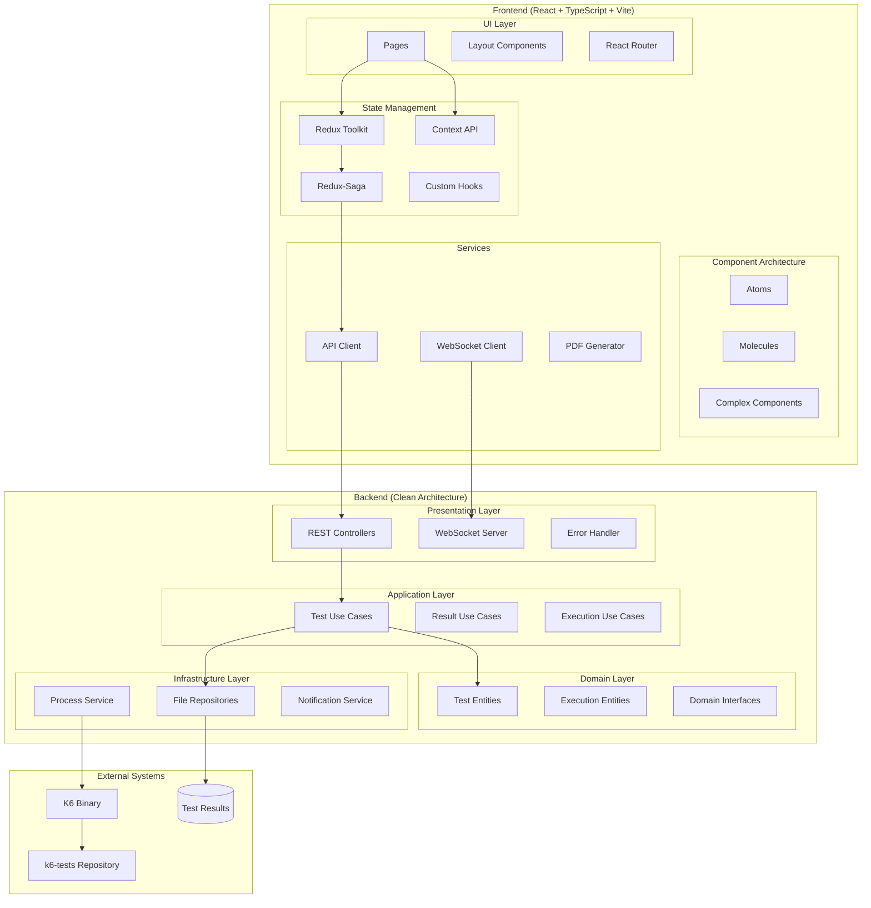
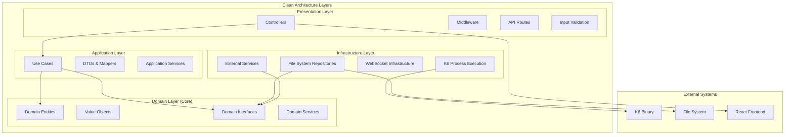
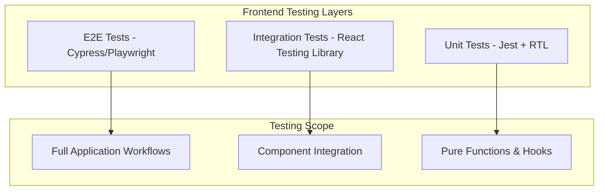
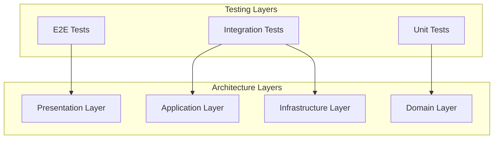

# K6 Performance Dashboard

<div align="center">


**Enterprise-Grade Performance Testing Dashboard with Clean Architecture**

[Features](#-features) • [Architecture](#-architecture) • [Installation](#-installation) • [Usage](#-usage) • [Technology Stack](#-technology-stack)

</div>

---

## 📋 Table of Contents

- [Overview](#-overview)
- [Features](#-features)
- [Architecture](#-architecture)
- [Technology Stack](#-technology-stack)
- [Project Structure](#-project-structure)
- [Backend Architecture Deep Dive](#-backend-architecture-deep-dive)
- [Frontend Architecture Deep Dive](#-frontend-architecture-deep-dive)
- [Installation & Setup](#-installation--setup)
- [Configuration](#-configuration)
- [Usage Guide](#-usage-guide)
- [API Documentation](#-api-documentation)
- [Development](#-development)
- [Deployment](#-deployment)

## 🎯 Overview

K6 Performance Dashboard is a comprehensive, enterprise-grade web application built with **Clean Architecture principles** for visualizing, managing, and analyzing K6 performance test results. The dashboard seamlessly integrates with the [k6-tests repository](https://github.com/dar-kow/k6-tests) to provide real-time test execution, advanced analytics, and professional PDF reporting capabilities.

### 🏗️ Architecture Highlights

- **Clean Architecture**: Complete separation of concerns with Domain → Application → Infrastructure → Presentation layers
- **SOLID Principles**: Dependency inversion, single responsibility, and interface segregation
- **Type Safety**: Full TypeScript implementation with strict mode
- **Dependency Injection**: Centralized IoC container for service management
- **Domain-Driven Design**: Rich domain entities with business logic
- **Error Handling**: Domain-specific errors with proper HTTP status codes
- **Modern Frontend**: React 18 with Redux Toolkit, Sagas, and Context API
- **Real-time Updates**: WebSocket integration with Socket.io

### Why This Solution?

Traditional performance testing often lacks proper visualization and architectural structure. This dashboard provides:

- **Enterprise-grade architecture** following Clean Architecture principles
- **Real-time test execution monitoring** with live terminal output
- **Advanced data visualization** with interactive charts and graphs
- **Professional PDF reports** for stakeholder communication
- **Multi-environment support** with custom token management
- **Historical data analysis** for performance trend tracking
- **Maintainable codebase** with proper separation of concerns
- **Modern frontend architecture** with state management and real-time updates

## 🚀 Features

### 📊 Advanced Dashboard Analytics
- **Real-time performance metrics** visualization
- **Interactive charts** using Recharts library
- **Multi-dimensional data analysis** (response times, throughput, error rates)
- **Comparative analysis** between test runs
- **Performance trend tracking** over time

### 🏃 Test Runner with Live Terminal
- **Real-time test execution** with WebSocket streaming
- **Environment selection** (PROD/DEV) with visual indicators
- **Custom token management** for authenticated endpoints
- **Load profile selection** (LIGHT/MEDIUM/HEAVY)
- **Individual or sequential test execution**
- **Live progress tracking** with K6 progress bars
- **Test interruption capability** with graceful shutdown

### 📑 Professional PDF Reports
- **Clean, professional design** using @react-pdf/renderer
- **Executive summary** with key metrics
- **Detailed performance analysis** with charts
- **Multi-page reports** with comprehensive insights
- **Automatic report generation** for each test run
- **Export capabilities** for individual tests or complete suites

### 🔍 Test Results Browser
- **Hierarchical test organization** by date and type
- **Individual test analysis** with detailed metrics
- **Sequential run analysis** for multi-test suites
- **Virtual directory support** for single test files
- **Tabbed interface** for easy navigation
- **Export functionality** for data and reports

### 🔄 Repository Management
- **Git repository integration** for test source management
- **Branch selection** and synchronization
- **Multi-repository support** with context switching
- **Configuration management** per repository

## 🏗 Architecture

### Full System Architecture



### Clean Architecture Overview



### Data Flow with Clean Architecture

1. **Test Execution Flow**
   - User action → Controller → Use Case → Domain Service → Infrastructure Service
   - ExecuteTestUseCase validates business rules and delegates to TestExecutionService
   - K6TestExecutionService spawns process and streams output via NotificationService
   - Results persisted via Repository pattern

2. **Results Analysis Flow**
   - Controller → GetTestDirectoriesUseCase → TestResultRepository
   - Domain entities (TestDirectory, TestFile) encapsulate business logic
   - Mappers transform entities to DTOs for API responses
   - Clean separation between domain logic and presentation concerns

## 💻 Technology Stack

### Frontend Technologies (Modern React Architecture)

| Technology | Purpose | Version | Implementation Details |
|------------|---------|---------|----------------------|
| **React** | UI Framework | 18.x | Modern functional components with hooks |
| **TypeScript** | Type Safety | 5.x | Strict mode with comprehensive type checking |
| **Vite** | Build Tool & Dev Server | 5.x | Fast HMR, optimized builds, ES modules |
| **Redux Toolkit** | State Management | 2.x | Simplified Redux with RTK Query potential |
| **Redux-Saga** | Side Effects Management | 1.x | Async flow control, WebSocket management |
| **Context API** | Local State Management | Built-in | Repository and test result contexts |
| **Tailwind CSS** | Styling Framework | 3.x | Utility-first CSS with custom components |
| **Recharts** | Data Visualization | 2.x | Interactive charts and graphs |
| **@react-pdf/renderer** | PDF Generation | 4.x | Professional PDF reports |
| **Socket.io-client** | Real-time Communication | 4.x | WebSocket connection management |
| **React Router** | Navigation | 6.x | Client-side routing with nested routes |
| **Axios** | HTTP Client | 1.x | API communication with interceptors |

### Backend Technologies (Clean Architecture)

| Technology | Purpose | Version |
|------------|---------|---------|
| **Node.js** | Runtime Environment | 18.x |
| **TypeScript** | Type Safety & Strict Mode | 5.x |
| **Express** | Web Framework | 4.x |
| **Socket.io** | WebSocket Server | 4.x |
| **dotenv** | Environment Configuration | 16.x |
| **Jest** | Testing Framework | 29.x |
| **ESLint + Prettier** | Code Quality & Formatting | Latest |
| **K6** | Load Testing Tool | 0.43.x |

### Architecture & Design Patterns

| Pattern/Principle | Implementation |
|------------------|----------------|
| **Clean Architecture** | Layered structure with dependency inversion |
| **SOLID Principles** | Dependency injection, interface segregation |
| **Repository Pattern** | Data access abstraction |
| **Use Case Pattern** | Business logic encapsulation |
| **Dependency Injection** | IoC container for service management |
| **Domain-Driven Design** | Rich domain entities with business logic |
| **Strategy Pattern** | Different test execution strategies |
| **Observer Pattern** | WebSocket notifications |
| **Component Composition** | Atomic design principles |
| **State Management** | Redux + Context API hybrid approach |

### Infrastructure & DevOps

| Technology | Purpose |
|------------|---------|
| **Docker** | Containerization |
| **Docker Compose** | Multi-container orchestration |
| **Nginx** | Reverse proxy (production) |
| **GitHub Actions** | CI/CD pipeline |

## 📁 Project Structure

```
k6-dashboard/
├── frontend/                     # React frontend application
│   ├── public/                   # Static assets
│   │   ├── index.html            # Main HTML template
│   │   └── favicon.ico           # Application favicon
│   │
│   ├── src/
│   │   ├── api/                  # 🌐 API Client Layer
│   │   │   ├── client.ts         # Axios client with interceptors
│   │   │   ├── repositories.ts   # Repository API endpoints
│   │   │   └── results.ts        # Test results API endpoints
│   │   │
│   │   ├── components/           # 🧩 Component Architecture
│   │   │   ├── atoms/            # Basic UI elements
│   │   │   │   └── LoadingSpinner.tsx
│   │   │   ├── molecules/        # Composed components
│   │   │   │   └── TestResultTabs.tsx
│   │   │   ├── charts/           # Data visualization components
│   │   │   │   ├── AreaChart.tsx
│   │   │   │   ├── BarChart.tsx
│   │   │   │   ├── LineChart.tsx
│   │   │   │   ├── MultiBarChart.tsx
│   │   │   │   ├── MultiLineChart.tsx
│   │   │   │   └── PieChart.tsx
│   │   │   ├── DirectorySelector.tsx
│   │   │   ├── EnhancedTestSelector.tsx
│   │   │   ├── Layout.tsx
│   │   │   ├── MetricCard.tsx
│   │   │   ├── PerformanceSummary.tsx
│   │   │   ├── RepositorySelector.tsx
│   │   │   ├── StatusCard.tsx
│   │   │   ├── SummaryCard.tsx
│   │   │   ├── TerminalOutput.tsx
│   │   │   ├── TestResultDetail.tsx
│   │   │   ├── TestResultTabs.tsx
│   │   │   ├── TestRunComparison.tsx
│   │   │   ├── TestRunSelector.tsx
│   │   │   └── TestSelector.tsx
│   │   │
│   │   ├── context/              # 🎯 Context API Providers
│   │   │   ├── RepositoryContext.tsx    # Repository state management
│   │   │   ├── TestResultContext.tsx    # Test results state
│   │   │   ├── PDFReportGenerator.tsx   # PDF generation context
│   │   │   ├── ExportPDFButton.tsx      # PDF export component
│   │   │   └── SingleTestPDFReport.tsx  # Single test PDF reports
│   │   │
│   │   ├── hooks/                # 🪝 Custom React Hooks
│   │   │   ├── useTestResults.ts        # Test results management
│   │   │   └── useDeduplicatedRequest.ts # Request deduplication
│   │   │
│   │   ├── pages/                # 📄 Route Components
│   │   │   ├── Dashboard.tsx     # Main dashboard with analytics
│   │   │   ├── TestResults.tsx   # Test results browser
│   │   │   └── TestRunner.tsx    # Test execution interface
│   │   │
│   │   ├── store/                # 🏪 Redux Store Architecture
│   │   │   ├── slices/           # Redux Toolkit slices
│   │   │   │   ├── testResultsSlice.ts  # Test results state
│   │   │   │   └── repositoriesSlice.ts # Repository state
│   │   │   ├── sagas/            # Redux-Saga side effects
│   │   │   │   ├── index.ts      # Root saga
│   │   │   │   ├── testResultsSaga.ts   # Test results sagas
│   │   │   │   └── repositoriesSaga.ts  # Repository sagas
│   │   │   ├── reducers.ts       # Combined reducers
│   │   │   └── index.ts          # Store configuration
│   │   │
│   │   ├── types/                # 📝 TypeScript Definitions
│   │   │   └── testResults.ts    # Domain type definitions
│   │   │
│   │   ├── App.tsx               # 🚀 Main application component
│   │   ├── main.tsx              # Vite entry point
│   │   └── index.css             # Global styles
│   │
│   ├── .env.example              # Environment variables template
│   ├── .eslintrc.js              # ESLint configuration
│   ├── package.json              # Dependencies and scripts
│   ├── postcss.config.js         # PostCSS configuration
│   ├── tailwind.config.js        # Tailwind CSS configuration
│   ├── tsconfig.json             # TypeScript configuration
│   ├── tsconfig.node.json        # Node TypeScript config
│   └── vite.config.ts            # Vite configuration
│
├── backend/                      # Clean Architecture Backend
│   ├── src/
│   │   ├── core/                 # 🏛️ DOMAIN LAYER (Core Business Logic)
│   │   │   ├── entities/         # Domain entities with business logic
│   │   │   │   ├── TestDirectory.ts
│   │   │   │   ├── TestFile.ts
│   │   │   │   ├── TestConfig.ts
│   │   │   │   ├── TestExecution.ts
│   │   │   │   ├── enums.ts      # Domain enums
│   │   │   │   └── index.ts
│   │   │   ├── value-objects/    # Value objects and commands
│   │   │   │   ├── Commands.ts   # Execute commands
│   │   │   │   ├── Events.ts     # Domain events
│   │   │   │   ├── TestOutput.ts # Test output value object
│   │   │   │   └── index.ts
│   │   │   ├── interfaces/       # Domain interfaces (contracts)
│   │   │   │   ├── common/       # Common interfaces
│   │   │   │   │   ├── IConfig.ts
│   │   │   │   │   └── ILogger.ts
│   │   │   │   ├── external/     # External service interfaces
│   │   │   │   │   ├── IFileSystem.ts
│   │   │   │   │   └── IProcessExecutor.ts
│   │   │   │   ├── repositories/ # Repository interfaces
│   │   │   │   │   ├── ITestRepository.ts
│   │   │   │   │   └── ITestResultRepository.ts
│   │   │   │   ├── services/     # Service interfaces
│   │   │   │   │   ├── ITestExecutionService.ts
│   │   │   │   │   └── INotificationService.ts
│   │   │   │   └── index.ts
│   │   │   ├── use-cases/        # Business use cases
│   │   │   │   ├── test-execution/
│   │   │   │   │   ├── ExecuteTestUseCase.ts
│   │   │   │   │   ├── ExecuteAllTestsUseCase.ts
│   │   │   │   │   ├── StopTestUseCase.ts
│   │   │   │   │   └── GetRunningTestsUseCase.ts
│   │   │   │   ├── test-results/
│   │   │   │   │   ├── GetTestDirectoriesUseCase.ts
│   │   │   │   │   ├── GetTestFilesUseCase.ts
│   │   │   │   │   └── GetTestResultUseCase.ts
│   │   │   │   ├── tests/
│   │   │   │   │   └── GetAvailableTestsUseCase.ts
│   │   │   │   └── index.ts
│   │   │   ├── errors/           # Domain-specific errors
│   │   │   │   ├── BaseError.ts
│   │   │   │   ├── DomainErrors.ts
│   │   │   │   └── index.ts
│   │   │   └── index.ts
│   │   │
│   │   ├── application/          # 🔧 APPLICATION LAYER (Use Cases & DTOs)
│   │   │   ├── dto/              # Data Transfer Objects
│   │   │   │   ├── TestExecutionDto.ts
│   │   │   │   ├── TestResultDto.ts
│   │   │   │   └── index.ts
│   │   │   ├── mappers/          # Entity ↔ DTO mappers
│   │   │   │   ├── TestExecutionMapper.ts
│   │   │   │   ├── TestResultMapper.ts
│   │   │   │   └── index.ts
│   │   │   ├── services/         # Application services
│   │   │   │   └── TestExecutionApplicationService.ts
│   │   │   └── index.ts
│   │   │
│   │   ├── infrastructure/       # 🏗️ INFRASTRUCTURE LAYER (External Concerns)
│   │   │   ├── external/         # External service implementations
│   │   │   │   ├── NodeFileSystem.ts
│   │   │   │   └── NodeProcessExecutor.ts
│   │   │   ├── repositories/     # Repository implementations
│   │   │   │   ├── FileSystemTestRepository.ts
│   │   │   │   └── FileSystemTestResultRepository.ts
│   │   │   ├── websocket/        # WebSocket infrastructure
│   │   │   │   ├── SocketIONotificationService.ts
│   │   │   │   └── WebSocketHandler.ts
│   │   │   └── index.ts
│   │   │
│   │   ├── presentation/         # 🌐 PRESENTATION LAYER (API & Web)
│   │   │   ├── controllers/      # HTTP controllers
│   │   │   │   ├── TestController.ts
│   │   │   │   ├── TestResultController.ts
│   │   │   │   ├── TestRunnerController.ts
│   │   │   │   └── HealthController.ts
│   │   │   ├── middleware/       # Express middleware
│   │   │   │   ├── ErrorHandler.ts
│   │   │   │   ├── RequestLogger.ts
│   │   │   │   ├── ValidationMiddleware.ts
│   │   │   │   └── SecurityMiddleware.ts
│   │   │   ├── routes/           # API routes
│   │   │   │   ├── TestRoutes.ts
│   │   │   │   ├── TestResultRoutes.ts
│   │   │   │   ├── TestRunnerRoutes.ts
│   │   │   │   └── HealthRoutes.ts
│   │   │   └── index.ts
│   │   │
│   │   ├── shared/               # 🔗 SHARED UTILITIES
│   │   │   ├── types/            # Shared type definitions
│   │   │   ├── utils/            # Utility functions
│   │   │   ├── constants/        # Application constants
│   │   │   └── index.ts
│   │   │
│   │   ├── config/               # ⚙️ CONFIGURATION
│   │   │   ├── Environment.ts    # Environment configuration
│   │   │   ├── Logger.ts         # Logging configuration
│   │   │   └── index.ts
│   │   │
│   │   ├── container.ts          # 📦 Dependency Injection Container
│   │   ├── app.ts                # 🚀 Application setup
│   │   └── server.ts             # 🎯 Entry point
│   │
│   ├── tests/                    # 🧪 Test suite
│   │   ├── unit/                 # Unit tests
│   │   ├── integration/          # Integration tests
│   │   ├── setup.ts              # Test setup
│   │   └── jest.setup.ts         # Jest configuration
│   │
│   ├── .env.example              # Environment variables template
│   ├── .eslintrc.js              # ESLint configuration
│   ├── jest.config.js            # Jest configuration
│   ├── nodemon.json              # Development server config
│   ├── package.json              # Dependencies and scripts
│   ├── start.sh                  # Startup script
│   └── tsconfig.json             # TypeScript configuration
│
├── docker/                       # Docker configuration
├── k6-tests/                     # Cloned from github.com/dar-kow/k6-tests
├── results/                      # Test results storage
├── docker-compose.yml            # Docker orchestration
└── README.md                     # This file
```

## 🏛️ Backend Architecture Deep Dive

### Clean Architecture Layers

#### 1. 🏛️ Domain Layer (Core)
The heart of the application containing business logic:

**Entities**: Rich domain objects with business behavior
```typescript
// TestDirectory.ts - Domain entity with business logic
export class TestDirectory {
  constructor(
    public readonly name: string,
    public readonly path: string,
    public readonly date: Date,
    public readonly type: "directory" | "virtual" = "directory"
  ) {}

  isVirtual(): boolean {
    return this.type === "virtual" || this.name.endsWith(".json");
  }

  getTestType(): string {
    if (this.isVirtual()) return "Individual Test";
    if (this.isSequential()) return "Sequential Run";
    return "Test Run";
  }
}
```

**Value Objects**: Immutable objects representing domain concepts
```typescript
// Commands.ts - Value objects for operations
export class ExecuteTestCommand {
  constructor(
    public readonly testName: string,
    public readonly profile: TestProfile,
    public readonly environment: Environment,
    public readonly customToken?: string
  ) {}

  getTestId(): string {
    return `${this.testName}-${Date.now()}`;
  }
}
```

**Use Cases**: Business operations and rules
```typescript
// ExecuteTestUseCase.ts - Business logic
export class ExecuteTestUseCase {
  constructor(
    private readonly testRepository: ITestRepository,
    private readonly testExecutionService: ITestExecutionService,
    private readonly logger: ILogger
  ) {}

  async execute(command: ExecuteTestCommand): Promise<TestExecution> {
    // Validate test exists
    const test = await this.testRepository.findByName(command.testName);
    if (!test) {
      throw new TestNotFoundError(command.testName);
    }

    // Execute business logic
    return await this.testExecutionService.executeTest(command);
  }
}
```

#### 2. 🔧 Application Layer
Orchestrates domain objects and external services:

**DTOs**: Data contracts for external communication
```typescript
export interface TestExecutionResponseDto {
  message: string;
  testId: string;
  config: {
    test?: string;
    profile: string;
    environment: string;
    hasCustomToken: boolean;
  };
}
```

**Mappers**: Transform between domain and external representations
```typescript
export class TestExecutionMapper {
  static toResponseDto(execution: TestExecution, message: string): TestExecutionResponseDto {
    return {
      message,
      testId: execution.testId,
      config: {
        test: execution.testName !== "all-tests" ? execution.testName : undefined,
        profile: execution.profile as string,
        environment: execution.environment as string,
        hasCustomToken: !!execution.customToken?.trim(),
      },
    };
  }
}
```

#### 3. 🏗️ Infrastructure Layer
Implements external concerns:

**Repository Implementations**: Data access
```typescript
export class FileSystemTestResultRepository implements ITestResultRepository {
  async findAll(): Promise<TestDirectory[]> {
    const resultsDir = await this.findResultsDirectory();
    const entries = await this.fileSystem.readDir(resultsDir);
    
    return entries
      .filter(entry => entry.isDirectory())
      .map(entry => new TestDirectory(entry.name, entry.path, this.extractDate(entry.name)));
  }
}
```

**External Service Adapters**: Process execution, file system
```typescript
export class NodeProcessExecutor implements IProcessExecutor {
  spawn(command: string, args: string[], options: ProcessOptions): IChildProcess {
    const child = spawn(command, args, {
      cwd: options.cwd,
      env: options.env,
      stdio: options.stdio || ['pipe', 'pipe', 'pipe'],
    });

    return {
      pid: child.pid || 0,
      stdout: child.stdout,
      stderr: child.stderr,
      // ... adapter methods
    };
  }
}
```

#### 4. 🌐 Presentation Layer
Handles HTTP concerns:

**Controllers**: HTTP request/response handling
```typescript
export class TestRunnerController {
  constructor(
    private readonly executeTestUseCase: ExecuteTestUseCase,
    private readonly logger: ILogger
  ) {}

  executeTest = async (req: Request, res: Response, next: NextFunction) => {
    try {
      const dto: TestExecutionRequestDto = req.body;
      const command = new ExecuteTestCommand(/* ... */);
      const execution = await this.executeTestUseCase.execute(command);
      const response = TestExecutionMapper.toResponseDto(execution, 'Test started successfully');
      res.json(response);
    } catch (error) {
      next(error);
    }
  };
}
```

### Dependency Injection Container

```typescript
export class DIContainer {
  private readonly services = new Map<string, any>();

  static getInstance(): DIContainer {
    if (!DIContainer.instance) {
      DIContainer.instance = new DIContainer();
    }
    return DIContainer.instance;
  }

  private registerServices(): void {
    // Configuration and Logger
    const config = new Environment();
    const logger = new ConsoleLogger(config.getLogLevel());
    
    // External services
    this.register<IFileSystem>('fileSystem', new NodeFileSystem());
    this.register<IProcessExecutor>('processExecutor', new NodeProcessExecutor());
    
    // Repositories
    this.register<ITestRepository>('testRepository', 
      new FileSystemTestRepository(
        this.get<IFileSystem>('fileSystem'),
        this.get<IConfig>('config'),
        this.get<ILogger>('logger')
      )
    );
    
    // Use cases
    this.register('executeTestUseCase',
      new ExecuteTestUseCase(
        this.get<ITestRepository>('testRepository'),
        this.get<ITestExecutionService>('testExecutionService'),
        this.get<ILogger>('logger')
      )
    );
  }
}
```

## 🎯 Frontend Architecture Deep Dive

### Modern React Architecture with Redux Toolkit + Saga

#### 1. 🏪 State Management Architecture

**Redux Toolkit Store Configuration**
```typescript
// store/index.ts - Store setup with middleware
import { configureStore } from "@reduxjs/toolkit";
import createSagaMiddleware from "redux-saga";
import { rootReducer } from "./reducers";
import rootSaga from "./sagas";

const sagaMiddleware = createSagaMiddleware();

export const store = configureStore({
  reducer: rootReducer,
  middleware: (getDefaultMiddleware) =>
    getDefaultMiddleware({ thunk: false }).concat(sagaMiddleware),
});

sagaMiddleware.run(rootSaga);

export type RootState = ReturnType<typeof store.getState>;
export type AppDispatch = typeof store.dispatch;
```

**Redux Toolkit Slices**
```typescript
// store/slices/testResultsSlice.ts - Modern Redux with RTK
import { createSlice, PayloadAction } from "@reduxjs/toolkit";
import { TestDirectory, TestFile, TestResult } from "@/types/testResults";

interface TestResultsState {
  directories: TestDirectory[];
  selectedDirectory: string | null;
  files: TestFile[];
  selectedFile: string | null;
  selectedTestResult: TestResult | null;
  loading: boolean;
  error: string | null;
}

const initialState: TestResultsState = {
  directories: [],
  selectedDirectory: null,
  files: [],
  selectedFile: null,
  selectedTestResult: null,
  loading: false,
  error: null,
};

export const testResultsSlice = createSlice({
  name: "testResults",
  initialState,
  reducers: {
    fetchDirectoriesRequest: (state, action: PayloadAction<string | undefined>) => {
      state.loading = true;
      state.error = null;
    },
    fetchDirectoriesSuccess: (state, action: PayloadAction<TestDirectory[]>) => {
      state.directories = action.payload;
      state.loading = false;
    },
    fetchDirectoriesFailure: (state, action: PayloadAction<string>) => {
      state.loading = false;
      state.error = action.payload;
    },
    setSelectedDirectory: (state, action: PayloadAction<string | null>) => {
      state.selectedDirectory = action.payload;
      state.selectedFile = null;
      state.selectedTestResult = null;
    },
    // ... other reducers
  },
});
```

**Redux-Saga Side Effects Management**
```typescript
// store/sagas/testResultsSaga.ts - Side effects with Saga
import { SagaIterator } from "redux-saga";
import { call, put, takeLatest, select } from "redux-saga/effects";
import { PayloadAction } from "@reduxjs/toolkit";
import { RootState } from "../index";
import {
  fetchDirectoriesRequest,
  fetchDirectoriesSuccess,
  fetchDirectoriesFailure,
} from "../slices/testResultsSlice";
import { fetchResultDirectories } from "@/api/results";

function* fetchDirectoriesSaga(action: PayloadAction<string | undefined>): SagaIterator {
  try {
    const directories = yield call(fetchResultDirectories, action.payload);
    yield put(fetchDirectoriesSuccess(directories));

    const selectedDirectory = yield select(
      (state: RootState) => state.testResults.selectedDirectory
    );
    if (directories.length > 0 && !selectedDirectory) {
      yield put({
        type: "testResults/setSelectedDirectory",
        payload: directories[0].name,
      });
    }
  } catch (error) {
    yield put(
      fetchDirectoriesFailure(
        error instanceof Error ? error.message : "Unknown error"
      )
    );
  }
}

export function* testResultsSaga() {
  yield takeLatest("testResults/fetchDirectoriesRequest", fetchDirectoriesSaga);
  // ... other saga watchers
}
```

#### 2. 🎯 Context API for Local State

**Repository Context Provider**
```typescript
// context/RepositoryContext.tsx - Context API for repository state
import React, { createContext, useContext, useState, useEffect, ReactNode } from 'react';
import { Repository, RepositoryConfig, fetchRepositories, fetchRepositoryConfig } from '../api/repositories';

interface RepositoryContextType {
  repositories: Repository[];
  selectedRepository: Repository | null;
  selectedRepositoryConfig: RepositoryConfig | null;
  loading: boolean;
  error: string | null;
  selectRepository: (repository: Repository | null) => void;
  refreshRepositories: () => Promise<void>;
  refreshConfig: () => Promise<void>;
}

const RepositoryContext = createContext<RepositoryContextType | undefined>(undefined);

export const useRepository = () => {
  const context = useContext(RepositoryContext);
  if (!context) {
    throw new Error('useRepository must be used within a RepositoryProvider');
  }
  return context;
};

export const RepositoryProvider: React.FC<{ children: ReactNode }> = ({ children }) => {
  const [repositories, setRepositories] = useState<Repository[]>([]);
  const [selectedRepository, setSelectedRepository] = useState<Repository | null>(null);
  const [selectedRepositoryConfig, setSelectedRepositoryConfig] = useState<RepositoryConfig | null>(null);
  const [loading, setLoading] = useState(false);
  const [error, setError] = useState<string | null>(null);

  // ... context implementation

  return <RepositoryContext.Provider value={value}>{children}</RepositoryContext.Provider>;
};
```

#### 3. 🪝 Custom Hooks Architecture

**Advanced Custom Hooks**
```typescript
// hooks/useTestResults.ts - Custom hook with Redux integration
import { useSelector, useDispatch } from "react-redux";
import { useCallback, useMemo } from "react";
import { RootState } from "@/store";
import {
  fetchDirectoriesRequest,
  setSelectedDirectory,
  fetchFilesRequest,
  setSelectedFile,
  refreshTestResults,
} from "@/store/slices/testResultsSlice";

export const useTestResults = () => {
  const dispatch = useDispatch();

  const {
    directories,
    selectedDirectory,
    files,
    selectedFile,
    selectedTestResult,
    loading,
    error,
  } = useSelector((state: RootState) => state.testResults);

  const selectedRepository = useSelector(
    (state: RootState) => state.repositories.selectedRepository
  );

  const fetchDirectories = useCallback(() => {
    dispatch(fetchDirectoriesRequest(selectedRepository?.id));
  }, [dispatch, selectedRepository?.id]);

  const selectDirectory = useCallback(
    (directory: string | null) => {
      dispatch(setSelectedDirectory(directory));
      if (directory) {
        dispatch(fetchFilesRequest(directory));
      }
    },
    [dispatch]
  );

  const sortedDirectories = useMemo(() => {
    return [...directories].sort((a, b) => b.date.getTime() - a.date.getTime());
  }, [directories]);

  return {
    directories: sortedDirectories,
    selectedDirectory,
    files,
    selectedFile,
    selectedTestResult,
    loading,
    error,
    fetchDirectories,
    selectDirectory,
    // ... other methods
  };
};
```

**Request Deduplication Hook**
```typescript
// hooks/useDeduplicatedRequest.ts - Advanced request optimization
import { useRef, useCallback } from "react";

export const useDeduplicatedRequest = <T extends (...args: any[]) => Promise<any>>(
  requestFn: T,
  cacheKey?: string
) => {
  const pendingRequests = useRef<Record<string, Promise<any>>>({});

  const dedupedRequestFn = useCallback(
    async (...args: Parameters<T>): Promise<ReturnType<T>> => {
      const key = cacheKey || JSON.stringify(args);

      if (key in pendingRequests.current) {
        return pendingRequests.current[key];
      }

      const requestPromise = requestFn(...args) as Promise<ReturnType<T>>;
      pendingRequests.current[key] = requestPromise;

      try {
        const result = await requestPromise;
        return result;
      } finally {
        delete pendingRequests.current[key];
      }
    },
    [requestFn, cacheKey]
  );

  return dedupedRequestFn;
};
```

#### 4. 🧩 Component Architecture (Atomic Design)

**Atomic Components Structure**
```typescript
// components/atoms/LoadingSpinner.tsx - Atomic component
import React from 'react';

interface LoadingSpinnerProps {
  size?: 'sm' | 'md' | 'lg';
  color?: string;
  fullPage?: boolean;
}

const LoadingSpinner: React.FC<LoadingSpinnerProps> = ({
  size = 'md',
  color = '#3b82f6',
  fullPage = false,
}) => {
  const sizeInPixels = {
    sm: 16,
    md: 32,
    lg: 48,
  }[size];

  // ... implementation with dynamic styles
};
```

**Molecular Components**
```typescript
// components/molecules/TestResultTabs.tsx - Composed component
import React, { memo, useCallback } from 'react';
import { TestFile } from '@/types/testResults';

interface TestResultTabsProps {
  files: TestFile[];
  selectedFile: string | null;
  onFileChange: (file: string) => void;
}

const TestResultTabs: React.FC<TestResultTabsProps> = memo(({
  files,
  selectedFile,
  onFileChange,
}) => {
  const formatFileName = useCallback((fileName: string) => {
    return fileName
      .replace('.json', '')
      .replace(/-/g, ' ')
      .split(' ')
      .map((word) => word.charAt(0).toUpperCase() + word.slice(1))
      .join(' ');
  }, []);

  // ... component implementation
});
```

#### 5. 🌐 API Client Architecture

**Advanced Axios Client with Interceptors**
```typescript
// api/client.ts - Robust API client
import axios, { AxiosInstance, AxiosRequestConfig, AxiosResponse, AxiosError } from "axios";

const API_URL = import.meta.env.VITE_API_URL || "http://localhost:4000/api";

const apiClient: AxiosInstance = axios.create({
  baseURL: API_URL,
  timeout: 15000,
  headers: {
    "Content-Type": "application/json",
  },
});

// Request interceptor with logging
apiClient.interceptors.request.use(
  (config) => {
    console.log("📡 API Request:", config.method?.toUpperCase(), config.url);
    return config;
  },
  (error) => {
    console.error("📡 API Request Error:", error);
    return Promise.reject(error);
  }
);

// Response interceptor with error handling
apiClient.interceptors.response.use(
  (response: AxiosResponse) => {
    console.log("📡 API Response:", response.status, response.config.url);
    return response;
  },
  (error: AxiosError) => {
    console.error("📡 API Error:", error.response?.status, error.message);

    if (error.response) {
      switch (error.response.status) {
        case 401:
          console.error("Unauthorized. Please login again.");
          break;
        case 403:
          console.error("Forbidden. You do not have permission.");
          break;
        case 404:
          console.error("Resource not found.");
          break;
        case 500:
          console.error("Server error. Please try again later.");
          break;
      }
    }

    return Promise.reject(error);
  }
);

// Retry mechanism with exponential backoff
export const withRetry = async <T>(
  fn: () => Promise<T>,
  maxRetries = 3,
  delay = 1000
): Promise<T> => {
  let lastError: any;

  for (let attempt = 0; attempt < maxRetries; attempt++) {
    try {
      return await fn();
    } catch (error) {
      lastError = error;
      console.warn(`Attempt ${attempt + 1} failed. Retrying in ${delay}ms...`);
      await new Promise((resolve) => setTimeout(resolve, delay));
      delay *= 2; // Exponential backoff
    }
  }

  throw lastError;
};

// API Cache implementation
export const createApiCache = () => {
  const cache = new Map<string, { data: any; timestamp: number }>();
  const CACHE_TTL = 5 * 60 * 1000; // 5 minutes

  const getCached = <T>(key: string): T | null => {
    const cached = cache.get(key);
    if (cached && Date.now() - cached.timestamp < CACHE_TTL) {
      return cached.data as T;
    }
    return null;
  };

  const setCache = <T>(key: string, data: T): void => {
    cache.set(key, { data, timestamp: Date.now() });
  };

  const invalidateCache = (keyPattern?: string): void => {
    if (!keyPattern) {
      cache.clear();
      return;
    }

    const regex = new RegExp(keyPattern);
    for (const key of Array.from(cache.keys())) {
      if (regex.test(key)) {
        cache.delete(key);
      }
    }
  };

  return { getCached, setCache, invalidateCache };
};

export const apiCache = createApiCache();
export default apiClient;
```

#### 6. 📊 Advanced Data Visualization

**Chart Components with Recharts**
```typescript
// components/charts/MultiLineChart.tsx - Advanced chart component
import React from 'react';
import {
  LineChart as RechartsLineChart,
  Line,
  XAxis,
  YAxis,
  CartesianGrid,
  Tooltip,
  Legend,
  ResponsiveContainer,
} from 'recharts';

interface DataSeries {
  key: string;
  name: string;
  color?: string;
}

interface MultiLineChartProps {
  title?: string;
  data: Array<Record<string, any>>;
  xKey: string;
  series: DataSeries[];
  yLabel?: string;
}

const MultiLineChart: React.FC<MultiLineChartProps> = ({
  title,
  data,
  xKey,
  series,
  yLabel,
}) => {
  const defaultColors = [
    '#3b82f6', '#ef4444', '#10b981', '#f59e0b',
    '#8b5cf6', '#ec4899', '#14b8a6', '#f97316',
  ];

  return (
    <div className="h-full w-full">
      {title && <h3 className="text-lg font-semibold mb-2">{title}</h3>}
      <ResponsiveContainer width="100%" height="100%">
        <RechartsLineChart data={data} margin={{ top: 5, right: 30, left: 20, bottom: 20 }}>
          <CartesianGrid strokeDasharray="3 3" />
          <XAxis dataKey={xKey} tick={{ fontSize: 12 }} />
          <YAxis
            label={yLabel ? { value: yLabel, angle: -90, position: 'insideLeft' } : undefined}
            tick={{ fontSize: 12 }}
          />
          <Tooltip
            contentStyle={{
              backgroundColor: 'rgba(255, 255, 255, 0.95)',
              border: '1px solid #E5E7EB',
              borderRadius: '4px',
              boxShadow: '0 1px 3px 0 rgba(0, 0, 0, 0.1)',
            }}
          />
          <Legend />
          {series.map((s, index) => (
            <Line
              key={s.key}
              type="monotone"
              dataKey={s.key}
              name={s.name}
              stroke={s.color || defaultColors[index % defaultColors.length]}
              strokeWidth={2}
              dot={{ r: 4 }}
              activeDot={{ r: 6 }}
            />
          ))}
        </RechartsLineChart>
      </ResponsiveContainer>
    </div>
  );
};

export default MultiLineChart;
```

#### 7. 📑 Professional PDF Generation

**Advanced PDF Reports with React-PDF**
```typescript
// context/PDFReportGenerator.tsx - Professional PDF generation
import React from 'react';
import { Document, Page, Text, View, StyleSheet, pdf } from '@react-pdf/renderer';
import { TestResult } from '../types/testResults';

const styles = StyleSheet.create({
  page: {
    flexDirection: 'column',
    backgroundColor: '#ffffff',
    padding: 30,
    fontFamily: 'Helvetica',
    fontSize: 11,
    lineHeight: 1.4,
  },
  header: {
    marginBottom: 25,
    borderBottom: 2,
    borderBottomColor: '#3B82F6',
    paddingBottom: 15,
  },
  title: {
    fontSize: 22,
    fontFamily: 'Helvetica-Bold',
    color: '#1F2937',
    marginBottom: 8,
  },
  // ... comprehensive styles
});

interface PDFReportProps {
  latestResults: Record<string, TestResult>;
  totalRequests: number;
  averageResponseTime: string;
  errorRate: string;
  lastRunTime: string;
  overallHealthStatus: 'healthy' | 'warning' | 'critical' | 'unknown';
  directoryName?: string;
}

const PDFReport: React.FC<PDFReportProps> = ({
  latestResults,
  totalRequests,
  averageResponseTime,
  errorRate,
  lastRunTime,
  overallHealthStatus,
  directoryName = '',
}) => {
  // ... PDF component implementation with multiple pages
  return (
    <Document>
      <Page size="A4" style={styles.page}>
        {/* Executive Summary Page */}
      </Page>
      <Page size="A4" style={styles.page}>
        {/* Detailed Analysis Page */}
      </Page>
    </Document>
  );
};

// Custom hook for PDF generation
export const usePDFReportGenerator = (props: PDFReportGeneratorHookProps) => {
  const generatePDF = async () => {
    try {
      const doc = <PDFReport {...props} />;
      const asPdf = pdf(doc);
      const blob = await asPdf.toBlob();

      // Create download link
      const url = URL.createObjectURL(blob);
      const link = document.createElement('a');
      link.href = url;
      link.download = `k6-report-${props.directoryName || 'test'}-${new Date().toISOString().slice(0, 10)}.pdf`;
      document.body.appendChild(link);
      link.click();
      document.body.removeChild(link);
      URL.revokeObjectURL(url);
    } catch (error) {
      console.error('Error generating PDF:', error);
      throw error;
    }
  };

  return { generatePDF };
};
```

#### 8. 🔄 Real-time WebSocket Integration

**WebSocket Client with Socket.io**
```typescript
// In TestRunner.tsx - Real-time test execution
import { io, Socket } from 'socket.io-client';

const TestRunner: React.FC = () => {
  const socketRef = useRef<Socket | null>(null);
  const [socketConnected, setSocketConnected] = useState<boolean>(false);
  const [output, setOutput] = useState<string[]>([]);

  useEffect(() => {
    const socket = io(BASE_URL, {
      withCredentials: true,
      reconnection: true,
      reconnectionAttempts: 5,
      reconnectionDelay: 1000
    });

    socketRef.current = socket;

    socket.on('connect', () => {
      console.log('WebSocket connection established');
      setSocketConnected(true);
    });

    socket.on('testOutput', (message) => {
      if (message.type === 'log') {
        setOutput(prev => [...prev, message.data]);
      } else if (message.type === 'complete') {
        setIsRunning(false);
        // Auto-refresh results
        setTimeout(() => refreshData(), 2000);
      }
    });

    socket.on('disconnect', () => {
      setSocketConnected(false);
    });

    return () => socket.disconnect();
  }, []);

  const runTest = async () => {
    if (socketRef.current && socketConnected) {
      socketRef.current.emit('test_request', {
        testId,
        test: selectedTest,
        profile: selectedProfile,
        environment,
        customToken,
      });
    }
  };

  // ... component implementation
};
```

#### 9. ⚙️ Vite Configuration & Build Optimization

**Advanced Vite Configuration**
```typescript
// vite.config.ts - Modern build configuration
import { defineConfig } from 'vite'
import react from '@vitejs/plugin-react'
import path from 'path'

export default defineConfig({
  plugins: [react()],
  resolve: {
    alias: {
      '@': path.resolve(__dirname, './src'),
      '@components': path.resolve(__dirname, './src/components'),
      '@pages': path.resolve(__dirname, './src/pages'),
      '@store': path.resolve(__dirname, './src/store'),
      '@api': path.resolve(__dirname, './src/api'),
      '@types': path.resolve(__dirname, './src/types'),
      '@hooks': path.resolve(__dirname, './src/hooks'),
      '@context': path.resolve(__dirname, './src/context'),
    },
  },
  server: {
    port: 3000,
    host: true, // Allow external connections
    proxy: {
      '/api': {
        target: 'http://localhost:4000',
        changeOrigin: true,
      },
      '/socket.io': {
        target: 'http://localhost:4000',
        ws: true,
      },
    },
  },
  build: {
    outDir: 'dist',
    sourcemap: true,
    rollupOptions: {
      output: {
        manualChunks: {
          vendor: ['react', 'react-dom'],
          redux: ['@reduxjs/toolkit', 'redux-saga', 'react-redux'],
          charts: ['recharts'],
          pdf: ['@react-pdf/renderer'],
          socket: ['socket.io-client'],
        },
      },
    },
  },
  define: {
    __APP_VERSION__: JSON.stringify(process.env.npm_package_version),
  },
})
```

#### 10. 📝 TypeScript Configuration

**Strict TypeScript Setup**
```json
// tsconfig.json - Strict TypeScript configuration
{
  "compilerOptions": {
    "target": "ES2022",
    "lib": ["ES2022", "DOM", "DOM.Iterable"],
    "allowJs": false,
    "skipLibCheck": true,
    "esModuleInterop": true,
    "allowSyntheticDefaultImports": true,
    "strict": true,
    "forceConsistentCasingInFileNames": true,
    "moduleResolution": "bundler",
    "allowImportingTsExtensions": true,
    "noFallthroughCasesInSwitch": true,
    "module": "ESNext",
    "resolveJsonModule": true,
    "isolatedModules": true,
    "noEmit": true,
    "jsx": "react-jsx",
    "baseUrl": "./src",
    "paths": {
      "@/*": ["*"],
      "@components/*": ["components/*"],
      "@pages/*": ["pages/*"],
      "@store/*": ["store/*"],
      "@api/*": ["api/*"],
      "@types/*": ["types/*"],
      "@hooks/*": ["hooks/*"],
      "@context/*": ["context/*"]
    }
  },
  "include": ["src", "vite.config.ts"],
  "exclude": ["node_modules", "dist"],
  "references": [{ "path": "./tsconfig.node.json" }]
}
```

### Frontend Architecture Benefits

1. **Scalability**: Modular architecture with clear separation of concerns
2. **Type Safety**: Comprehensive TypeScript coverage with strict mode
3. **Performance**: Code splitting, lazy loading, and optimized builds
4. **Developer Experience**: Hot reloading, TypeScript IntelliSense, Redux DevTools
5. **Maintainability**: Clear component hierarchy and state management patterns
6. **Testing**: Easy unit testing with isolated components and mocked dependencies
7. **Real-time Features**: WebSocket integration for live updates
8. **Professional Output**: High-quality PDF generation capabilities

### Benefits of Clean Architecture Implementation

1. **Testability**: Easy unit testing with mocked dependencies
2. **Maintainability**: Changes isolated to specific layers
3. **Scalability**: Easy to add new features following established patterns
4. **Flexibility**: Can swap implementations (e.g., database instead of file system)
5. **Domain Focus**: Business logic separated from technical concerns

## 🛠 Installation & Setup

### Prerequisites

- Docker and Docker Compose
- Node.js 18+ (for local development)
- Git

### Quick Start with Docker

```bash
# Clone the dashboard repository
git clone https://github.com/your-username/k6-dashboard.git
cd k6-dashboard

# Clone k6-tests repository
git clone https://github.com/dar-kow/k6-tests.git

# Start the application
docker-compose up -d

# Access the dashboard
open http://localhost
```

### Local Development Setup

#### Backend Setup
```bash
cd backend

# Install dependencies
npm install

# Create environment configuration
cp .env.example .env

# Edit .env file with your paths:
# K6_TESTS_DIR=../k6-tests
# RESULTS_DIR=../k6-tests/results
# NODE_ENV=development
# LOG_LEVEL=debug

# Run in development mode
npm run dev
```

#### Frontend Setup
```bash
# In a new terminal
cd frontend

# Install dependencies
npm install

# Create environment configuration
cp .env.example .env

# Edit .env file:
# VITE_API_URL=http://localhost:4000/api

# Start development server
npm run dev
```

### Development Tools

#### Frontend Development Scripts
```bash
# Development
npm run dev          # Start Vite dev server with HMR
npm run build        # Build for production
npm run preview      # Preview production build
npm run type-check   # TypeScript type checking
npm run lint         # ESLint checking
npm run lint:fix     # Auto-fix ESLint issues

# Testing
npm run test         # Run tests
npm run test:watch   # Watch mode testing
npm run test:coverage # Generate coverage report
```

#### Backend Development Scripts
```bash
# Development
npm run dev          # Start with hot reload
npm run build        # Build TypeScript
npm run test         # Run test suite
npm run test:watch   # Watch mode testing
npm run test:coverage # Generate coverage report
npm run lint         # Check code quality
npm run lint:fix     # Auto-fix linting issues

# Debugging
npm run debug:paths  # Debug path resolution
```

## ⚙️ Configuration

### Environment Variables

#### Backend Configuration (.env)
```env
# Server Configuration
NODE_ENV=development
PORT=4000
FRONTEND_URL=http://localhost:3000

# K6 Tests Configuration
# Path to k6-tests directory (relative to backend/ or absolute)
K6_TESTS_DIR=../k6-tests

# Results Configuration  
# Path to test results directory
RESULTS_DIR=../k6-tests/results

# Logging Level (debug, info, warn, error)
LOG_LEVEL=debug

# Production Example:
# NODE_ENV=production
# K6_TESTS_DIR=/app/k6-tests
# RESULTS_DIR=/app/results
# LOG_LEVEL=info
```

#### Frontend Configuration (.env)
```env
# API Configuration
VITE_API_URL=http://localhost:4000/api

# Build Configuration
VITE_APP_TITLE=K6 Performance Dashboard
VITE_APP_VERSION=1.0.0

# Development
VITE_DEBUG=true
```

### TypeScript Configuration

#### Frontend (tsconfig.json)
```json
{
  "compilerOptions": {
    "target": "ES2022",
    "lib": ["ES2022", "DOM", "DOM.Iterable"],
    "allowJs": false,
    "skipLibCheck": true,
    "esModuleInterop": true,
    "allowSyntheticDefaultImports": true,
    "strict": true,
    "forceConsistentCasingInFileNames": true,
    "moduleResolution": "bundler",
    "allowImportingTsExtensions": true,
    "noFallthroughCasesInSwitch": true,
    "module": "ESNext",
    "resolveJsonModule": true,
    "isolatedModules": true,
    "noEmit": true,
    "jsx": "react-jsx",
    "baseUrl": "./src",
    "paths": {
      "@/*": ["*"],
      "@components/*": ["components/*"],
      "@pages/*": ["pages/*"],
      "@store/*": ["store/*"],
      "@api/*": ["api/*"],
      "@types/*": ["types/*"],
      "@hooks/*": ["hooks/*"],
      "@context/*": ["context/*"]
    }
  },
  "include": ["src", "vite.config.ts"],
  "exclude": ["node_modules", "dist"]
}
```

#### Backend (tsconfig.json)
```json
{
  "compilerOptions": {
    "target": "ES2022",
    "module": "ES2022",
    "moduleResolution": "bundler",
    "strict": true,
    "baseUrl": "./src",
    "paths": {
      "@core/*": ["core/*"],
      "@infrastructure/*": ["infrastructure/*"],
      "@application/*": ["application/*"],
      "@presentation/*": ["presentation/*"]
    }
  }
}
```

### K6 Test Configuration

The dashboard automatically integrates with the k6-tests repository structure:
- Test files are loaded from `k6-tests/tests/`
- Results are saved to `results/` directory
- Configuration is read from `k6-tests/config/env.js`

## 📖 Usage Guide

### Running Performance Tests

1. **Navigate to Test Runner**
   - Click "Test Runner" in the sidebar

2. **Configure Test Parameters**
   - Select environment (PROD/DEV)
   - Set custom token if required
   - Choose test to run
   - Select load profile

3. **Execute Tests**
   - Click "Run Selected Test" or "Run All Tests Sequentially"
   - Monitor real-time output in terminal
   - Stop tests if needed with the stop button

### Analyzing Results

1. **Access Test Results**
   - Click "Test Results" in the sidebar
   - Select test run from dropdown

2. **Review Performance Data**
   - Examine summary metrics
   - Analyze detailed charts
   - Review individual test tabs

3. **Generate Reports**
   - Click "Export Test PDF" for individual tests
   - Click "Export Detailed PDF Report" for comprehensive analysis

### Understanding Load Profiles

| Profile | Virtual Users | Duration | Use Case |
|---------|--------------|----------|----------|
| LIGHT | 10 | 60s | Quick validation |
| MEDIUM | 30 | 5m | Standard testing |
| HEAVY | 100 | 10m | Stress testing |

## 🔌 API Documentation

### REST Endpoints

All endpoints follow Clean Architecture principles with proper error handling and validation.

#### Test Management
```http
GET /api/tests
Returns: TestConfigDto[]
Description: Get available test configurations

POST /api/run/test
Body: TestExecutionRequestDto
Returns: TestExecutionResponseDto
Description: Execute individual test

POST /api/run/all
Body: TestExecutionRequestDto (without test field)
Returns: TestExecutionResponseDto
Description: Execute all tests sequentially

POST /api/run/stop
Body: StopTestRequestDto
Returns: StopTestResponseDto
Description: Stop running test

GET /api/run/status
Returns: RunningTestsResponseDto
Description: Get currently running tests
```

#### Results Management
```http
GET /api/results
Returns: TestDirectoryDto[]
Description: Get all test run directories

GET /api/results/:directory
Returns: TestFileDto[]
Description: Get test files in directory

GET /api/results/:directory/:file
Returns: TestResult
Description: Get specific test result data
```

#### Repository Management
```http
GET /api/repositories
Returns: Repository[]
Description: Get all configured repositories

POST /api/repositories
Body: CreateRepositoryRequest
Returns: Repository
Description: Create new repository

GET /api/repositories/:id/config
Returns: RepositoryConfig
Description: Get repository configuration

POST /api/repositories/:id/sync
Description: Sync repository with remote

DELETE /api/repositories/:id
Description: Delete repository
```

#### Health & Debug
```http
GET /health
Returns: HealthStatus
Description: Application health check

GET /debug/config
Returns: ConfigDebugInfo
Description: Current configuration (dev only)

GET /debug/paths
Returns: PathDebugInfo
Description: File path resolution debug (dev only)
```

### WebSocket Events

#### Client → Server
```javascript
'test_request': { test, profile, environment, customToken, testId }
'stop_test': { testId }
```

#### Server → Client
```javascript
'testOutput': { 
  type: 'log'|'error'|'complete'|'stopped', 
  data: string,
  testId: string,
  timestamp: Date
}

'resultsUpdated': { 
  message: string,
  testName?: string,
  resultFile?: string,
  timestamp: string
}

'connection_established': {
  message: string,
  socketId: string,
  timestamp: string
}
```

## 🔨 Development

### Code Style Guidelines

- **TypeScript**: Strict mode enabled with comprehensive type checking
- **Clean Architecture**: Maintain layer separation and dependency direction
- **SOLID Principles**: Follow dependency inversion and interface segregation
- **Testing**: Jest with high coverage requirements
- **Linting**: ESLint + Prettier for consistent code style

### Frontend Development Guidelines

#### Component Development
- **Functional Components**: Use React functional components with hooks
- **TypeScript**: All components must have proper TypeScript interfaces
- **Memoization**: Use React.memo for performance optimization
- **Custom Hooks**: Extract complex logic into reusable hooks
- **Error Boundaries**: Implement error boundaries for robust error handling

#### State Management
- **Redux Toolkit**: Use RTK for global state management
- **Redux-Saga**: Handle side effects with sagas
- **Context API**: Use for localized state that doesn't need global access
- **Custom Hooks**: Create custom hooks for component state logic

#### Testing Frontend Components
```typescript
// Example component test
import { render, screen, fireEvent } from '@testing-library/react';
import { Provider } from 'react-redux';
import { store } from '@store/index';
import TestComponent from './TestComponent';

describe('TestComponent', () => {
  const renderWithStore = (component: React.ReactElement) => {
    return render(
      <Provider store={store}>
        {component}
      </Provider>
    );
  };

  it('should render component correctly', () => {
    renderWithStore(<TestComponent />);
    expect(screen.getByText('Expected Text')).toBeInTheDocument();
  });

  it('should handle user interactions', () => {
    renderWithStore(<TestComponent />);
    fireEvent.click(screen.getByRole('button'));
    expect(screen.getByText('Updated Text')).toBeInTheDocument();
  });
});
```

### Adding New Features

#### 1. New Frontend Feature
```typescript
// 1. Define types
interface NewFeature {
  id: string;
  name: string;
  data: any;
}

// 2. Create Redux slice
const newFeatureSlice = createSlice({
  name: 'newFeature',
  initialState,
  reducers: {
    fetchNewFeatureRequest: (state) => {
      state.loading = true;
    },
    fetchNewFeatureSuccess: (state, action) => {
      state.data = action.payload;
      state.loading = false;
    },
  },
});

// 3. Create saga
function* fetchNewFeatureSaga() {
  try {
    const data = yield call(api.fetchNewFeature);
    yield put(fetchNewFeatureSuccess(data));
  } catch (error) {
    yield put(fetchNewFeatureFailure(error.message));
  }
}

// 4. Create component
const NewFeatureComponent: React.FC = () => {
  const dispatch = useDispatch();
  const { data, loading } = useSelector(state => state.newFeature);

  useEffect(() => {
    dispatch(fetchNewFeatureRequest());
  }, [dispatch]);

  return (
    <div>
      {loading ? <LoadingSpinner /> : <div>{data}</div>}
    </div>
  );
};

// 5. Add to routing
<Route path="/new-feature" element={<NewFeatureComponent />} />
```

#### 2. New Backend Use Case
```typescript
// Follow the backend patterns shown earlier
// 1. Define interface in core/interfaces/
// 2. Create use case in core/use-cases/
// 3. Implement service in infrastructure/
// 4. Add controller in presentation/
// 5. Register in DI container
```

### Testing Strategy

#### Frontend Testing Pyramid



#### Unit Tests (Frontend)
```typescript
// Testing custom hooks
import { renderHook, act } from '@testing-library/react';
import { useTestResults } from '@hooks/useTestResults';

describe('useTestResults', () => {
  it('should fetch directories on mount', async () => {
    const { result } = renderHook(() => useTestResults());
    
    await act(async () => {
      result.current.fetchDirectories();
    });

    expect(result.current.loading).toBe(false);
    expect(result.current.directories).toHaveLength(0);
  });
});

// Testing Redux slices
import { testResultsSlice, fetchDirectoriesSuccess } from '@store/slices/testResultsSlice';

describe('testResultsSlice', () => {
  it('should handle fetchDirectoriesSuccess', () => {
    const initialState = { directories: [], loading: true };
    const directories = [{ name: 'test', path: '/test', date: new Date() }];
    
    const action = fetchDirectoriesSuccess(directories);
    const state = testResultsSlice.reducer(initialState, action);

    expect(state.directories).toEqual(directories);
    expect(state.loading).toBe(false);
  });
});
```

#### Integration Tests (Frontend)
```typescript
// Testing component integration with Redux
import { render, screen } from '@testing-library/react';
import { Provider } from 'react-redux';
import { configureStore } from '@reduxjs/toolkit';
import Dashboard from '@pages/Dashboard';
import { testResultsSlice } from '@store/slices/testResultsSlice';

const createTestStore = (initialState = {}) => {
  return configureStore({
    reducer: {
      testResults: testResultsSlice.reducer,
    },
    preloadedState: initialState,
  });
};

describe('Dashboard Integration', () => {
  it('should display test results when available', () => {
    const store = createTestStore({
      testResults: {
        directories: [{ name: 'test', path: '/test', date: new Date() }],
        loading: false,
      },
    });

    render(
      <Provider store={store}>
        <Dashboard />
      </Provider>
    );

    expect(screen.getByText('Dashboard')).toBeInTheDocument();
  });
});
```

#### Backend Unit Tests
```typescript
describe('ExecuteTestUseCase', () => {
  let useCase: ExecuteTestUseCase;
  let mockRepository: jest.Mocked<ITestRepository>;
  let mockExecutionService: jest.Mocked<ITestExecutionService>;

  beforeEach(() => {
    mockRepository = {
      findByName: jest.fn(),
      findAll: jest.fn(),
      exists: jest.fn(),
    };

    mockExecutionService = {
      executeTest: jest.fn(),
      stopTest: jest.fn(),
      getRunningTests: jest.fn(),
      isTestRunning: jest.fn(),
    };

    useCase = new ExecuteTestUseCase(
      mockRepository,
      mockExecutionService,
      mockLogger
    );
  });

  it('should execute test when test exists', async () => {
    // Arrange
    const command = new ExecuteTestCommand('test-name', TestProfile.LIGHT, Environment.PROD);
    const mockTest = new TestConfig('test-name', 'Test Description', '/path/to/test');
    const mockExecution = new TestExecution('test-id', 'test-name', TestProfile.LIGHT, Environment.PROD);

    mockRepository.findByName.mockResolvedValue(mockTest);
    mockExecutionService.executeTest.mockResolvedValue(mockExecution);

    // Act
    const result = await useCase.execute(command);

    // Assert
    expect(mockRepository.findByName).toHaveBeenCalledWith('test-name');
    expect(mockExecutionService.executeTest).toHaveBeenCalledWith(command);
    expect(result).toBe(mockExecution);
  });

  it('should throw TestNotFoundError when test does not exist', async () => {
    // Arrange
    const command = new ExecuteTestCommand('non-existent', TestProfile.LIGHT, Environment.PROD);
    mockRepository.findByName.mockResolvedValue(null);

    // Act & Assert
    await expect(useCase.execute(command)).rejects.toThrow(TestNotFoundError);
  });
});
```

#### Integration Tests (Backend)
```typescript
describe('TestRunner Integration', () => {
  let app: Application;
  let request: supertest.SuperTest<supertest.Test>;

  beforeAll(async () => {
    app = new Application();
    await app.start();
    request = supertest(app.getExpressApp());
  });

  it('should execute test via API', async () => {
    const response = await request
      .post('/api/run/test')
      .send({
        test: 'load-test',
        profile: 'LIGHT',
        environment: 'PROD'
      })
      .expect(200);

    expect(response.body).toHaveProperty('testId');
    expect(response.body.config.test).toBe('load-test');
  });
});
```

### Building for Production

#### Frontend Build
```bash
cd frontend

# Type checking
npm run type-check

# Build for production
npm run build

# Preview production build
npm run preview
```

#### Backend Build
```bash
cd backend

# Build TypeScript
npm run build

# Run tests
npm run test

# Start production server
NODE_ENV=production npm start
```

#### Docker Build
```bash
# Build all services
docker-compose build

# Build specific service
docker-compose build frontend
docker-compose build backend
```

## 🚀 Deployment

### Docker Deployment

```bash
# Production deployment
docker-compose -f docker-compose.prod.yml up -d
```

### Manual Deployment

1. **Frontend Deployment**
   ```bash
   cd frontend
   npm run build
   # Serve dist/ directory with Nginx or similar
   ```

2. **Backend Deployment**
   ```bash
   cd backend
   npm run build
   cp .env.example .env.production
   # Edit .env.production with production values
   NODE_ENV=production npm start
   ```

### Environment-Specific Configuration

#### Development
```env
# Frontend
VITE_API_URL=http://localhost:4000/api
VITE_DEBUG=true

# Backend
NODE_ENV=development
LOG_LEVEL=debug
K6_TESTS_DIR=../k6-tests
RESULTS_DIR=../k6-tests/results
```

#### Production
```env
# Frontend
VITE_API_URL=https://api.yourdomain.com/api
VITE_DEBUG=false

# Backend
NODE_ENV=production
LOG_LEVEL=info
K6_TESTS_DIR=/app/k6-tests
RESULTS_DIR=/app/results
```

#### Docker
```env
# Frontend
VITE_API_URL=http://localhost:4000/api

# Backend
NODE_ENV=production
K6_TESTS_DIR=/k6-tests
RESULTS_DIR=/results
```

### CI/CD Pipeline

Example GitHub Actions workflow:
```yaml
name: Deploy K6 Dashboard

on:
  push:
    branches: [main]

jobs:
  test-frontend:
    runs-on: ubuntu-latest
    steps:
      - uses: actions/checkout@v3
      - name: Setup Node.js
        uses: actions/setup-node@v3
        with:
          node-version: '18'
      
      - name: Test Frontend
        run: |
          cd frontend
          npm install
          npm run type-check
          npm run test -- --coverage --watchAll=false
          npm run build

  test-backend:
    runs-on: ubuntu-latest
    steps:
      - uses: actions/checkout@v3
      - name: Setup Node.js
        uses: actions/setup-node@v3
        with:
          node-version: '18'
      
      - name: Test Backend
        run: |
          cd backend
          npm install
          npm run test:coverage
          npm run build

  deploy:
    needs: [test-frontend, test-backend]
    runs-on: ubuntu-latest
    if: github.ref == 'refs/heads/main'
    steps:
      - name: Deploy to Production
        run: |
          ssh user@server 'cd /app && git pull && docker-compose up -d --build'
```

## 📊 Performance Considerations

### Frontend Performance
- **Code Splitting**: Vite automatically splits chunks for optimal loading
- **Lazy Loading**: Components loaded on demand with React.lazy
- **Redux Optimization**: Normalized state structure and memoized selectors
- **Chart Performance**: Virtualized rendering for large datasets
- **WebSocket Optimization**: Connection pooling and message batching

### Backend Performance
- **Clean Architecture Benefits**: Clear separation allows for targeted optimizations
- **Caching Strategy**: Implement Redis adapter for frequently accessed test results
- **File System Optimization**: Regular cleanup of old test results via scheduled use case
- **WebSocket Scaling**: Socket.io Redis adapter for horizontal scaling
- **PDF Generation**: Background job queue for large report generation
- **Database Migration**: Easy to switch from file system to database with repository pattern

## 🔒 Security Best Practices

### Frontend Security
- **Input Validation**: All inputs validated at component level
- **XSS Protection**: React's built-in XSS protection with proper escaping
- **CORS Configuration**: Strict origin validation
- **Token Management**: Secure token storage with environment isolation
- **Content Security Policy**: Implemented via Vite configuration

### Backend Security
- **Input Validation**: All inputs validated at presentation layer
- **Domain Validation**: Business rules enforced in use cases
- **Error Handling**: Domain errors don't leak infrastructure details
- **Token Management**: Secure token handling with environment isolation
- **File Access**: Repository pattern restricts access to designated directories
- **Process Isolation**: K6 processes run with limited permissions through infrastructure layer
- **CORS Configuration**: Strict origin validation in presentation layer

## 🧪 Testing Architecture

The clean architecture enables comprehensive testing at each layer:

### Testing Pyramid



- **Unit Tests**: Domain entities, value objects, use cases, React components, Redux slices
- **Integration Tests**: Repository implementations, external services, component integration
- **E2E Tests**: Full API workflows through presentation layer, user journeys

## 🤝 Contributing

### Development Workflow

1. Fork the repository
2. Create feature branch (`git checkout -b feature/amazing-feature`)
3. Follow Clean Architecture principles (backend) and Component Architecture (frontend)
4. Write tests for all layers
5. Ensure TypeScript strict mode compliance
6. Commit with conventional commits (`git commit -m 'feat: add amazing feature'`)
7. Push to branch (`git push origin feature/amazing-feature`)
8. Open Pull Request

### Code Review Guidelines

#### Frontend
- Verify proper component architecture (atoms/molecules/organisms)
- Check Redux state management patterns
- Ensure TypeScript strict compliance
- Review custom hooks implementation
- Validate WebSocket integration
- Check PDF generation functionality

#### Backend
- Verify proper layer separation
- Check dependency direction (inward only)
- Ensure comprehensive test coverage
- Validate TypeScript strict compliance
- Review error handling at all layers

## 📝 License

This project is licensed under the MIT License - see the LICENSE file for details.

## 🙏 Acknowledgments

- [Clean Architecture](https://blog.cleancoder.com/uncle-bob/2012/08/13/the-clean-architecture.html) by Robert C. Martin
- [Redux Toolkit](https://redux-toolkit.js.org/) for simplified Redux
- [Redux-Saga](https://redux-saga.js.org/) for side effect management
- [Vite](https://vitejs.dev/) for fast development and building
- [K6](https://k6.io/) for the excellent load testing tool
- [Grafana Labs](https://grafana.com/) for maintaining K6
- [TypeScript](https://www.typescriptlang.org/) community for exceptional tooling
- [React](https://reactjs.org/) community for the amazing ecosystem

---

<div align="center">

**Built with ❤️ for the Performance Testing Community**  
**Following Clean Architecture & Modern React Principles**

[Report Bug](https://github.com/your-username/k6-dashboard/issues) • [Request Feature](https://github.com/your-username/k6-dashboard/issues) • [Architecture Guide](./docs/ARCHITECTURE.md)

</div></parameter>
</invoke>
</artifacts>

