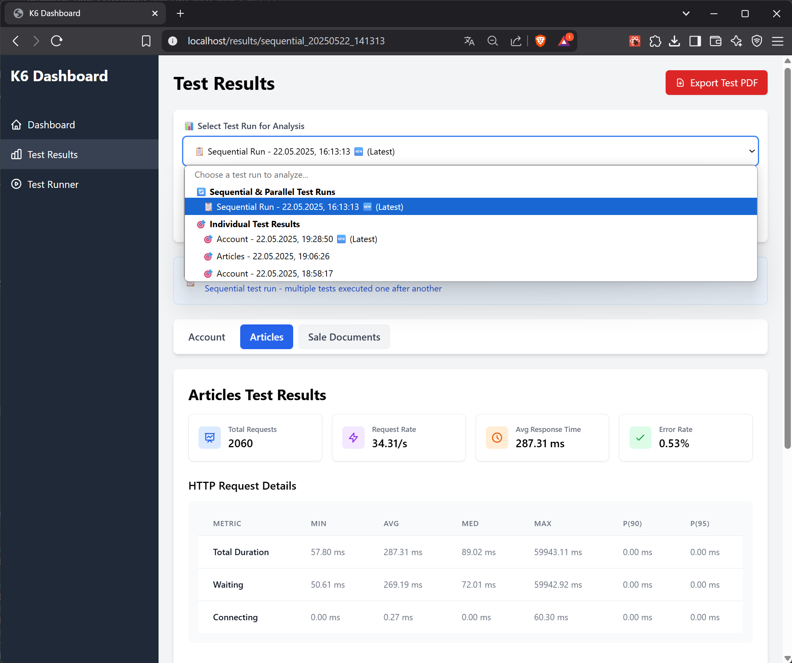
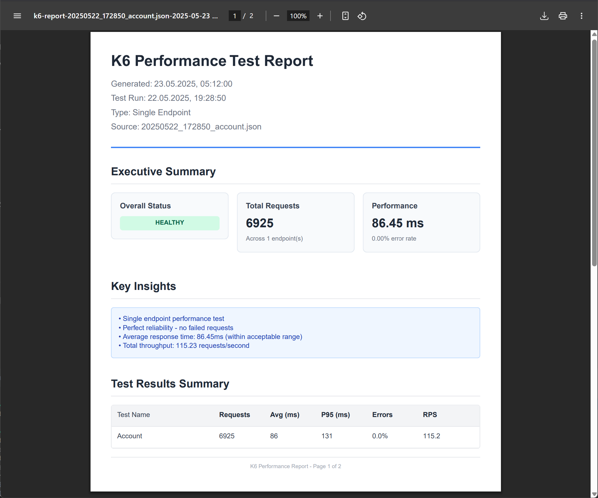

# K6 Performance Dashboard - User Guide

<div align="center">


**Professional Performance Testing Dashboard**

[Quick Start](#-quick-start) • [Dashboard](#-dashboard-overview) • [Test Runner](#-test-runner) • [Results Analysis](#-test-results-analysis) • [PDF Reports](#-pdf-reports)

</div>

---

## 📋 Table of Contents

- [Quick Start](#-quick-start)
- [Dashboard Overview](#-dashboard-overview)
- [Test Runner](#-test-runner)
- [Test Results Analysis](#-test-results-analysis)
- [PDF Reports](#-pdf-reports)
- [Advanced Features](#-advanced-features)
- [Best Practices](#-best-practices)
- [Troubleshooting](#-troubleshooting)

## 🚀 Quick Start

### First Launch

After launching the K6 Dashboard (via Docker or locally), you'll be greeted with the main dashboard interface:

<div align="center" style="padding: 20px;">
  
  <p><em>K6 Dashboard - Main Overview</em></p>
</div>

### Navigation Structure

The application features a clean, intuitive sidebar navigation with three main sections:

| Section | Icon | Purpose |
|---------|------|---------|
| **Dashboard** | 🏠 | System overview and key metrics |
| **Test Results** | 📊 | Detailed analysis and history |
| **Test Runner** | ▶️ | Execute and monitor tests |

## 📊 Dashboard Overview

The Dashboard provides executive-level insights into your performance testing ecosystem:

<div align="center" style="padding: 20px;">
  
  <p><em>Real-time Performance Metrics</em></p>
</div>

### Key Components

#### 1. Health Status Indicator
- **🟢 Healthy**: All systems performing optimally (< 1% error rate)
- **🟡 Warning**: Minor issues detected (1-5% error rate)
- **🔴 Critical**: Significant problems requiring attention (> 5% error rate)

#### 2. Performance Metrics Cards
Real-time display of:
- **Total Requests**: Cumulative request count across all tests
- **Average Response Time**: Mean response time with trend indicator
- **Error Rate**: Percentage of failed requests with severity coloring
- **Throughput**: Requests per second across all endpoints

#### 3. Interactive Charts Section

<div align="center" style="padding: 20px;">
  
  <p><em>Interactive Performance Charts</em></p>
</div>

- **Response Time Comparison**: Bar chart comparing average and P95 response times
- **Request Volume Analysis**: Distribution of requests across different endpoints
- **Performance Trends**: Line chart showing performance evolution over time
- **Success vs Error Rate**: Pie chart visualizing reliability metrics
- **Throughput Analysis**: Area chart displaying request rate patterns
- **Test Checks Results**: Stacked bar chart of pass/fail validations

### Test Run Selector

The intelligent test run selector provides:
- **Auto-selection** of the most recent test run
- **Type indicators** (Sequential 📋, Parallel ⚡, Individual 🎯)
- **Timestamp display** in Polish timezone
- **Quick filters** for test type selection

## 🏃 Test Runner

The Test Runner provides a powerful interface for executing performance tests:

<div align="center" style="padding: 20px;">
  
  <p><em>Test Runner - Configuration Interface</em></p>
</div>

### Environment Configuration

#### Environment Toggle
Switch between environments with visual feedback:
- **🔵 PROD**: Production environment (default)
- **🟠 DEV**: Development environment

<div align="center" style="padding: 20px;">
  
  <p><em>Environment and Token Configuration</em></p>
</div>

#### Token Management
- Click **"Set Token"** to open the secure token input modal
- Tokens are encrypted and stored in browser localStorage
- Visual indicator shows when custom token is active

### Test Configuration

#### Available Tests
Select from the integrated k6-tests repository:
- **Contractors**: Contractor management endpoints
- **Invoices**: Invoice processing tests
- **Invoice Items**: Detailed invoice item operations
- **Articles**: Article management endpoints
- **Sale Documents**: Sales document workflows

#### Load Profiles

| Profile | Virtual Users | Duration | Memory | Use Case |
|---------|--------------|----------|---------|----------|
| **🟢 LIGHT** | 10 VUs | 60s | ~50MB | Smoke testing, quick validation |
| **🟡 MEDIUM** | 30 VUs | 5m | ~150MB | Standard load testing |
| **🔴 HEAVY** | 100 VUs | 10m | ~500MB | Stress testing, peak load |

### Live Terminal Output

<div align="center" style="padding: 20px;">
  
  <p><em>Real-time Test Execution with K6 Progress Bars</em></p>
</div>

#### Terminal Features
- **ANSI Color Support**: Colored output for better readability
- **K6 Progress Bars**: Visual progress indicators
- **Auto-scroll Toggle**: Control automatic scrolling behavior
- **Manual Navigation**: Top/Bottom quick navigation buttons
- **Line Counter**: Track output volume
- **Stop Functionality**: Graceful test interruption with confirmation

### Execution Controls

1. **Run Selected Test**: Execute individual test with current configuration
2. **Run All Tests Sequentially**: Execute complete test suite in order
3. **Stop Test**: Interrupt running test with confirmation dialog
4. **Clear Output**: Clean terminal for new test run

## 📈 Test Results Analysis

The Test Results page provides comprehensive analysis capabilities:

<div align="center" style="padding: 20px;">
  
  <p><em>Test Results - Comprehensive Analysis View</em></p>
</div>

### Directory Navigation

#### Test Run Types
- **📋 Sequential Runs**: Multiple tests executed in sequence
- **⚡ Parallel Runs**: Concurrent test execution
- **🎯 Individual Tests**: Single endpoint focused testing

### Detailed Metrics Analysis

<div align="center" style="padding: 20px;">
  
  <p><em>Detailed Performance Metrics and Analysis</em></p>
</div>

#### HTTP Request Details Table
Comprehensive metrics including:
- **Response Time Percentiles**: Min, Avg, Med, Max, P90, P95
- **Request Phases**: Blocked, Connecting, Sending, Waiting, Receiving
- **TLS Handshaking**: SSL/TLS connection metrics
- **Data Transfer**: Sent and received data volumes

#### Performance Checks
Visual representation of test validations:
- **Pass Rate**: Percentage of successful checks
- **Status Indicators**: Color-coded performance status
- **Detailed Breakdown**: Individual check results

### Tab Navigation

<div align="center" style="padding: 20px;">
  
  <p><em>Multi-test Navigation with Tabs</em></p>
</div>

Switch between different tests within a run:
- Click tabs to navigate between tests
- Active tab highlighted in blue
- Test names automatically formatted for readability

## 📑 PDF Reports

### Professional Report Generation

<div align="center" style="padding: 20px;">
  
  <p><em>Professional PDF Report Example</em></p>
</div>

#### Report Types

1. **Individual Test Reports**
   - Single test detailed analysis
   - Request timing breakdown
   - Performance insights
   - Optimized single-page layout

2. **Comprehensive Suite Reports**
   - Multi-page executive summary
   - Cross-test comparison
   - Trend analysis
   - Actionable recommendations

#### Report Contents
- **Executive Summary**: High-level metrics and status
- **Performance Analysis**: Detailed charts and graphs
- **Test Comparison**: Side-by-side endpoint analysis
- **Recommendations**: AI-generated improvement suggestions
- **Technical Details**: Configuration and environment info

## 🎯 Advanced Features

### Performance Comparison

<div align="center" style="padding: 20px;">
  
  <p><em>Compare Performance Across Test Runs</em></p>
</div>

- **Historical Analysis**: Compare current vs. previous runs
- **Trend Detection**: Identify performance degradation
- **Quick Compare**: One-click comparison suggestions

### Real-time WebSocket Updates

- **Live Progress**: See test progress as it happens
- **Instant Results**: Results appear immediately after completion
- **Auto-refresh**: Dashboard updates automatically

### Smart Result Organization

- **Virtual Directories**: Single test files appear as directories
- **Chronological Sorting**: Latest results always on top
- **Type Grouping**: Tests grouped by execution type

## 💡 Best Practices

### Testing Strategy

1. **Progressive Load Testing**
   ```
   Day 1: LIGHT profile → Validate functionality
   Day 2: MEDIUM profile → Check normal load
   Day 3: HEAVY profile → Stress test limits
   ```

2. **Regular Monitoring**
   - Schedule daily LIGHT tests
   - Weekly MEDIUM load tests
   - Monthly HEAVY stress tests

3. **Performance Baselines**
   - Establish baseline metrics
   - Set acceptable thresholds
   - Monitor deviation trends

### Interpreting Results

#### Response Time Analysis
- **< 100ms**: Excellent
- **100-500ms**: Good
- **500-1000ms**: Acceptable
- **> 1000ms**: Needs optimization

#### Error Rate Thresholds
- **0%**: Perfect reliability
- **< 0.1%**: Production ready
- **0.1-1%**: Monitor closely
- **> 1%**: Immediate attention required

#### Throughput Indicators
- Compare against expected load
- Monitor for bottlenecks
- Identify scaling requirements

## 🔧 Troubleshooting

### Common Issues

#### No Test Results Appearing
```bash
# Check results directory
ls -la ./results/

# Verify k6 execution
docker logs k6-dashboard-backend

# Check file permissions
chmod -R 755 ./results/
```

#### WebSocket Connection Issues
1. Verify backend is running: `docker ps`
2. Check browser console for errors
3. Ensure CORS settings are correct
4. Try clearing browser cache

#### PDF Generation Failures
- Check browser console for errors
- Verify sufficient memory available
- Try generating smaller reports first

#### Test Execution Errors
- Verify k6 binary installation
- Check authentication tokens
- Review terminal output for specific errors

### Performance Optimization

1. **Large Result Sets**
   - Implement pagination for directories > 100
   - Archive old results regularly
   - Use result filtering

2. **Slow Chart Rendering**
   - Limit data points to 1000
   - Use data aggregation
   - Enable chart animations selectively

3. **Memory Usage**
   - Close unused tabs
   - Clear terminal output periodically
   - Limit concurrent test executions
